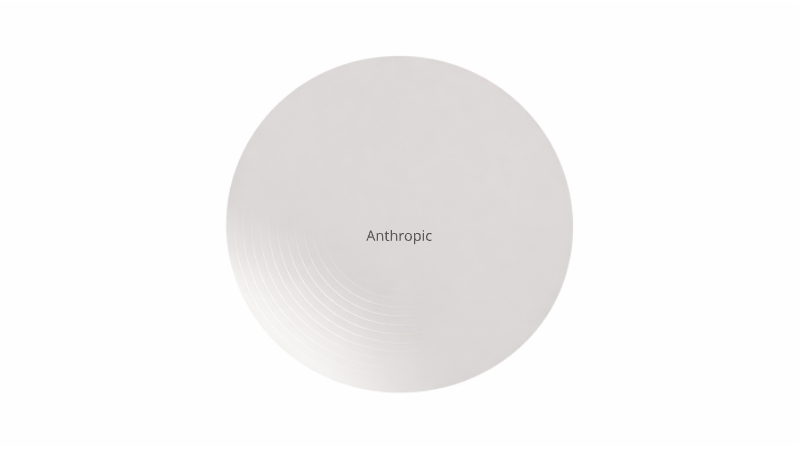

# Anatomy of Anthropic — The Philosophy, Products, Economics, and Governance Behind the World's Most Deliberate AI Company

**Anthropic解体新書 — 世界で最も慎重なAI企業の思想・製品・経済・統治を構造化する**

  

*Read this in other languages: [English](README_en.md)*

---

## 📖 概要

Anthropicは、世界で最も慎重なAI企業であると同時に、世界で最も破壊的なAI企業である。

Claude Codeは6ヶ月で年間売上10億ドルに到達し、Coworkはソフトウェア株2,850億ドルの暴落を引き起こし、MCPはLinux Foundationに寄贈されてAI接続の業界標準となった。国防総省との契約を倫理的理由で拒否した同じ月に、App Storeでダウンロード数1位を獲得した。

なぜ「慎重さ」と「破壊力」は矛盾しないのか。

本書は、この企業体を「解剖」する。起源（PBC / LTBT）、思想（Constitutional AI / Mechanistic Interpretability）、技術（Haiku / Sonnet / Opus）、製品（Claude Code / Cowork / MCP）、経済（Anthropic Economic Index）、統治（RSP / 倫理ブランド）。6つのレイヤーを構造化し、全てが一貫した設計によって接続されていることを解き明かす。

**解剖してみたら、1つの設計図が出てきた。それがAnthropicという企業の正体である。**

本書は、[Silence of Intelligence](https://github.com/Leading-AI-IO/silence-of-intelligence)（ダリオ・アモディの思想を構造分析した書籍）の続編であり、「思想」から「企業体の全容」へと射程を拡張する。

---

## 🏗️ 構成

本書は全6章で構成される。

| 章 | タイトル | 解剖対象 |
|---|---|---|
| 第1章 | The Split — OpenAIからの分岐と、Anthropicが生まれた構造的必然 | 起源。Scaling Lawsの発見者がスケーリングの危険を訴えた矛盾。PBC（公益法人）とLTBT（長期利益信託）の設計 |
| 第2章 | Constitutional AI — AIに「憲法」を与えるという思想実験 | 思想。RLHFの限界、原則→自己批判→修正のループ、Claude's Character、Mechanistic Interpretability |
| 第3章 | The Model Architecture — Haiku, Sonnet, Opus | 技術。3ティア構造の設計思想、「大きい＝良い」を2回破壊した歴史、Extended Thinking、Computer Use、Agent Team |
| 第4章 | The Product Trinity — Claude Code, Cowork, MCP | 製品。ターミナルの制圧、デスクトップの制圧、プロトコル層の制圧。「対話ではなく実行、会話ではなく作業」の統一戦略 |
| 第5章 | The Economic Index — 自らの破壊力を測定する企業 | 経済。Clio、5つの経済プリミティブ、49%の職業への浸透、22-25歳の採用減速、「危機を測定するが処方箋を出さない」空白 |
| 第6章 | The Deliberate Company — なぜAnthropicは「最も慎重」でありながら「最も破壊的」なのか | 統治。RSP v3.0、国防総省拒否→App Store 1位の逆説、フライホイール構造、慎重さと破壊力のパラドックスの解消 |

---

## 📄 ドキュメント

| ファイル | 言語 | 内容 |
|---|---|---|
| [anatomy_of_anthropic_jp.md](./docs/anatomy_of_anthropic_jp.md) | 🇯🇵 日本語 | 本文（日本語版） |
| [anatomy_of_anthropic_en.md](./docs/en/anatomy_of_anthropic_en.md) | 🇺🇸 English | 本文（英語版） |

---

## 🔗 Related Projects

本書は、以下のOSSプロジェクトと相互に接続されている。

| プロジェクト | 概要 | リンク |
|---|---|---|
| **The Silence of Intelligence** | Anthropic CEO ダリオ・アモディの思想を構造分析。本書の前編 | [GitHub](https://github.com/Leading-AI-IO/silence-of-intelligence) |
| **What They Won't Teach You** | AIに有利な世代が教えない、AIの使い方と"思考のOS"。Economic Indexの空白を埋める処方箋 | [GitHub](https://github.com/Leading-AI-IO/what-they-wont-teach-you) |
| **Depth & Velocity** | 生成AI時代の新規事業開発方法論。10:80:10モデル | [GitHub](https://github.com/Leading-AI-IO/depth-and-velocity) |
| **The Orchestrator** | AI時代に最も希少な人材の定義 | [GitHub](https://github.com/Leading-AI-IO/the-orchestrator-in-the-ai-era) |
| **The Palantir Impact** | Palantir Foundryのオントロジー戦略を解剖。産業構造の解剖シリーズ第1弾 | [GitHub](https://github.com/Leading-AI-IO/palantir-ontology-strategy) |
| **The Redesign of Design Strategy** | AI時代のデザイン戦略を再定義 | [GitHub](https://github.com/Leading-AI-IO/design-strategy-in-the-ai-era) |
| **The Edge of Intelligence** | オンデバイスAI時代の構造変化 | [GitHub](https://github.com/Leading-AI-IO/edge-ai-intelligence) |
| **The AI Strategist** | AIストラテジストの定義 | [GitHub](https://github.com/Leading-AI-IO/the-ai-strategist) |

---

## 👤 著者

**Satoshi Yamauchi** (山内 怜史) 
* **AI Strategist & Business Designer at Sun Asterisk Inc.**
* **Founder / AI Strategist at Leading.AI**

* This project is part of the research by Leading.AI.

* [📒 Read my insights on Note](https://note.com/satoshi_yamauchi)
* [🌐 Visit Leading.AI Official Website](https://www.leading-ai.io/)

---

## 🤝 Contributing

Issues and Pull Requests are welcome. Anthropicの製品戦略・ガバナンス構造に関する議論、参考文献の追加、誤字脱字の修正など、皆様からのContributeを歓迎します。

---

## 📝 License

This work is licensed under a [Creative Commons Attribution 4.0 International License](https://creativecommons.org/licenses/by/4.0/). 
© 2026 Satoshi Yamauchi / Leading AI — Licensed under CC BY 4.0

---

*Anatomy of Anthropic is an independent analysis. It is not affiliated with, endorsed by, or sponsored by Anthropic, PBC.*
