# Anatomy of Anthropic — The Philosophy, Products, Economics, and Governance Behind the World's Most Deliberate AI Company

  

# Chapter 1: The Split — The Structural Inevitability Behind Anthropic's Birth

## 1.1 The Paradox of the Man Who Discovered Scaling — and Then Warned Against It

In 2020, Dario Amodei, then VP of Research at OpenAI, stood at the center of one of the most consequential discoveries in AI history.

"Scaling Laws for Neural Language Models" — a paper demonstrating that language model performance improves according to power laws across three variables: parameter count, dataset size, and compute. Derived from training over 400 models, this law proved that AI capability would continue improving in predictable ways.

That discovery simultaneously produced two contradictory conclusions about the future of AI.

* **Conclusion 1:** If you scale models, performance keeps improving. Therefore, scale as fast as possible.

* **Conclusion 2:** If you scale models, performance keeps improving. Therefore, safety must be ensured before scaling becomes uncontrollable.

Sam Altman chose Conclusion 1. Dario Amodei chose Conclusion 2.

This divergence was not a matter of personality differences or management philosophy. It was a structural choice between two logically equivalent conclusions drawn from the same data.

> **Fig.1: The Fork — Two Conclusions from the Same Discovery**

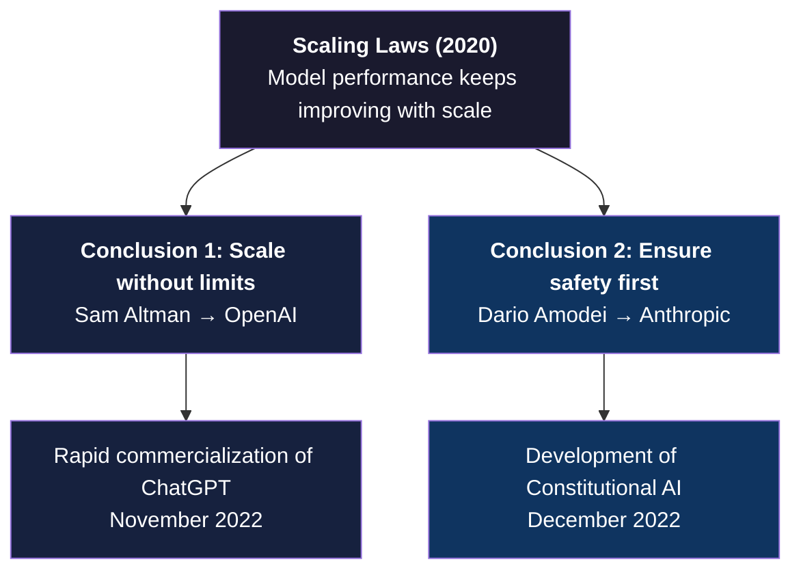

---

## 1.2 The 2021 Split: The Day Eleven Researchers Left

In 2021, Dario Amodei left OpenAI. He was not alone. Approximately eleven researchers, including his sister Daniela Amodei (now Anthropic's President), resigned simultaneously.

Many media outlets summarized their departure as "concerns over safety." But that framing misses the deeper point.

The core issue was OpenAI's organizational structure.

OpenAI was founded in 2015 as a nonprofit. But in 2019, to accept investment from Microsoft, it converted to a "capped-profit corporation" — a for-profit entity with a ceiling on returns, an unprecedented corporate structure.

This structural shift created fundamental tension around the priority of research versus commercialization. The more Sam Altman accelerated ChatGPT's commercial rollout, the greater the risk that safety research would be deprioritized.

What Dario Amodei sought was not simply to "take safety seriously." He wanted an organizational structure in which prioritizing safety was structurally guaranteed.

## 1.3 PBC — The Choice to Become a Public Benefit Corporation

Anthropic was incorporated in 2021 as a **Public Benefit Corporation (PBC)** under Delaware law.

What is a PBC?

An ordinary corporation has a primary legal obligation to maximize shareholder returns. A board that makes decisions against shareholder interest faces litigation risk.

A PBC is different. The board is legally required to balance shareholder returns against the public good. That means decisions like "sacrifice short-term profit for safety" are legally justifiable.

This choice was not an expression of Dario Amodei's personal convictions. It was the design of a legal foundation ensuring that decisions prioritizing safety could be made sustainably at the organizational level.

While OpenAI transitioned from nonprofit to for-profit, Anthropic was founded from the start with the legal structure to balance profit and public benefit built in.

This contrast continues to function as a fundamental differentiator between the two companies as of 2026. OpenAI is pushing toward full for-profit conversion; Anthropic maintains its PBC structure.

## 1.4 LTBT — The Design of the Long-Term Benefit Trust

Dario Amodei concluded that a PBC alone was not sufficient.

As a corporation, investor influence remained. With Anthropic having accepted massive investments from Amazon, Google, and Salesforce, the PBC legal framework alone could not guarantee that the company would never yield to investors' short-term demands.

The answer was the **LTBT (Long-Term Benefit Trust)**.

The LTBT is an independent trust with the authority to appoint Anthropic's board of directors. In ordinary companies, shareholders elect directors. At Anthropic, the LTBT appoints directors, and those directors oversee management.

The implications are profound.

Investors provide capital but hold no direct authority to control strategic direction. The LTBT is charged with ensuring that Anthropic remains faithful to its mission of developing safe and beneficial AI.

If the PBC creates a structure in which "sacrificing safety is legally justifiable," the LTBT creates a mechanism in which "decisions that sacrifice safety become structurally difficult."

> **Fig.2: Governance Structure Comparison — Ordinary Corporation vs. Anthropic**

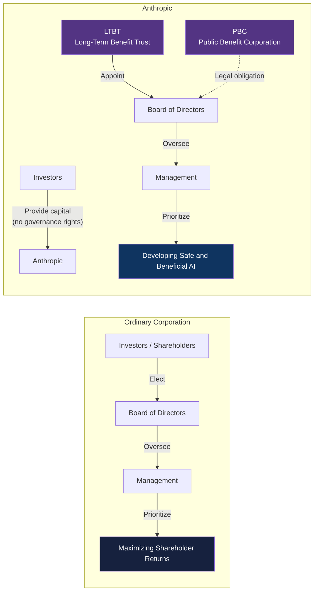

## 1.5 The "Structural Inevitability" of a $380B Company

As of March 2026, Anthropic's valuation has reached $380 billion. Revenue is projected to double from $9 billion in 2025 to $19 billion in 2026.

These numbers alone make it look like a typical Silicon Valley startup success story. But Anthropic's growth curve has a fundamentally different structure from other AI companies.

* **Typical startup:** As the company grows, pressure mounts to accelerate commercialization to meet investor expectations. Safety investment is treated as a "cost."

* **Anthropic:** As the company grows, investment in safety research increases. The fruits of safety research (Constitutional AI, Mechanistic Interpretability) become product differentiators, which generate revenue, which gets reinvested into safety research.

This flywheel — safety research → trust → adoption → revenue → research investment — cannot function without the organizational design of PBC and LTBT.

Dario Amodei leaving OpenAI, founding a PBC, and designing the LTBT is not a story of "a safety-minded person building a safety-minded company."

**He designed a structure in which safety would be sustainably prioritized.** And that structure now serves as the foundation of the fastest-growing AI company in 2026.

## 1.6 Chapter Summary

| Dimension | OpenAI | Anthropic |
|---|---|---|
| Legal form at founding | Nonprofit → converted to for-profit | Founded as PBC |
| Governance structure | Board (investor-influenced) | LTBT appoints directors |
| Stance on scaling | Scale at full speed | Pursue scaling and safety simultaneously |
| Position of safety | One division among many | Legal obligation built into corporate structure |
| 2026 status | Pushing toward full for-profit conversion | Maintaining PBC structure |

Anthropic is a company born from a split. But that split was not accidental — it was structurally inevitable.

The person who discovered the scaling laws understood most deeply the dangers of scaling. That person designed PBC and LTBT to structurally guarantee safety. And paradoxically, that structure gave birth to the most disruptive AI company.

The next chapter dissects Anthropic's ideological foundation — the unprecedented experiment of giving AI a "constitution."

### References

1. Kaplan, J., McCandlish, S., Henighan, T., et al. (2020). "Scaling Laws for Neural Language Models." *arXiv:2001.08361*. [OpenAI Research]
2. Anthropic. (2023). "Anthropic's Long-Term Benefit Trust." *anthropic.com*
3. Anthropic. (2023). "Core Views on AI Safety." *anthropic.com*
4. Amodei, D. (2024). "Machines of Loving Grace." *darioamodei.com*
5. OpenAI. (2019). "OpenAI LP." *openai.com/blog*
6. Delaware General Corporation Law, Subchapter XV — Public Benefit Corporations. *delcode.delaware.gov*
7. Anthropic. (2025). "Responsible Scaling Policy v3.0." *anthropic.com*
8. Yamauchi, S. (2025). *Silence of Intelligence — A Structural Analysis of Dario Amodei's Philosophy*. Leading AI, LLC. CC BY 4.0. [GitHub](https://github.com/Leading-AI-IO/silence-of-intelligence)

 

---

# Chapter 2: Constitutional AI — The Thought Experiment of Giving AI a "Constitution"

## 2.1 The Limits of RLHF — Is Human Feedback Really the "Right Answer"?

The standard method for ensuring AI model safety was RLHF (Reinforcement Learning from Human Feedback).

The mechanism of RLHF is intuitive. Human evaluators compare multiple AI-generated responses and select the "good" ones. That evaluation data trains the AI. The AI's outputs are progressively adjusted toward what humans judge as "good."

OpenAI, Anthropic, and Google all adopted this approach. But Dario Amodei and Anthropic's research team identified fundamental limits in RLHF.

* **Limit 1: Scalability.**
As AI models become more sophisticated, the expertise required for evaluation increases. The number of humans capable of properly evaluating state-of-the-art AI outputs is limited.

* **Limit 2: Consistency.**
Human evaluators make different judgments about the same question. Evaluations fluctuate with culture, values, and the evaluator's state of mind on a given day. The larger the evaluation team, the greater the variance in standards.

* **Limit 3: Transparency.**
There are no explicit criteria for why a given response was judged "good." Training that relies on tacit knowledge makes AI behavior difficult to predict.

Anthropic's question was straightforward: instead of human feedback, what if we gave AI "principles" directly?

## 2.2 Constitutional AI — The Loop of Principle → Self-Critique → Revision

In December 2022, Anthropic published a paper titled "Constitutional AI: Harmlessness from AI Feedback."

The core of Constitutional AI (CAI) is a method that replaces human evaluators with a "constitution" — a set of explicit principles — given to the AI, allowing the AI to evaluate and revise its own outputs.

The process consists of three stages.

* **Step 1: Generate.**
The AI generates a response. At this stage, responses containing harmful content are permitted.

* **Step 2: Self-critique.**
The AI conducts a critical evaluation of the generated response based on the constitutional principles. "Does this response violate Principle X?" "Is there a more appropriate formulation?"

* **Step 3: Revise.**
Based on the self-critique, the AI revises its response. The revised response is used as reinforcement learning data.

The innovation of this loop lies not in removing humans from the evaluation process. It lies in shifting the human role from "evaluating individual responses" to "designing principles."

Instead of judging the quality of each individual response, humans define the principles the AI should follow. Designing principles is a high-level intellectual task, but once designed, they are applied consistently to millions of responses.

> **Fig.3: The Constitutional AI Loop — Autonomous Improvement Based on Principles**

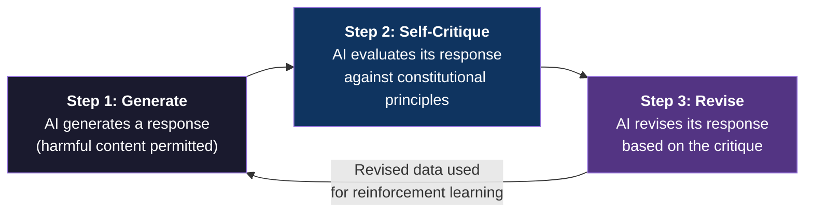

| | RLHF | Constitutional AI |
|---|---|---|
| **Evaluator** | Human evaluation team | AI itself (based on principles) |
| **Human role** | Evaluate individual responses | Design principles |
| **Scalability** | Dependent on evaluator count | One set of principles applied to all responses |
| **Consistency** | Varies across evaluators | Consistent based on principles |
| **Transparency** | Tacit knowledge (unclear why "good") | Explicit (described as principles) |

## 2.3 Claude's 2026 Constitution — Four Core Principles

Claude's constitution is publicly available. In the 2026 version, four core principles form a hierarchical structure.

* **Principle 1: Safe and Supports Human Oversight.**
Claude supports human oversight and control. The highest-priority principle, preventing AI from evading human supervision or autonomously expanding its scope of action.

* **Principle 2: Behaves Ethically.**
Be honest, avoid causing harm, comply with the law. However, Principle 1 (safety) takes precedence over Principle 2 (ethics). Even ethically correct actions are constrained if they compromise safety.

* **Principle 3: Acts in Accordance with Anthropic's Guidelines.**
Specific operational rules: content policies, usage restrictions, and response protocols for particular topics. Applies only within the bounds of Principles 1 and 2.

* **Principle 4: Helpful to the User.**
Respond to user requests as fully as possible. But will not comply with requests that violate Principles 1, 2, or 3.

What this hierarchy means is that "helpfulness" sits at the bottom.

Most AI companies design helpfulness to users as the top priority. Anthropic placed helpfulness at the lowest rank of four principles: safety → ethics → guidelines → helpfulness. This priority order is structurally reflected in every one of Claude's responses.

> **Fig.4: Claude's Four Core Principles — Helpfulness Ranks Last**

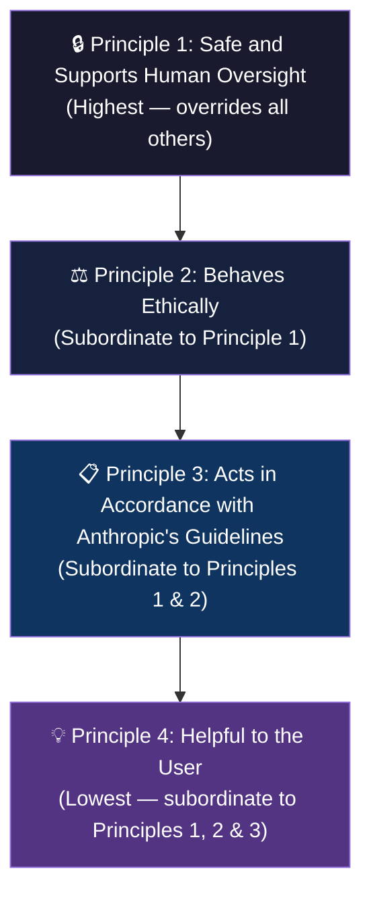

## 2.4 Claude's Character — Beyond "Helpful, Honest, and Harmless"

In 2025, Anthropic published a document titled "Claude's Character," defining what kind of "personality" Claude should have.

In early discussions of AI safety, the ideal was described as "helpful, honest, and harmless" — the so-called HHH framework. Anthropic itself had adopted this framework.

But Claude's Character goes beyond those three elements. It specifically defines:

* **Claude is "intellectually curious."**
Not simply answering user questions, but maintaining a disposition to explore the structure of problems.

* **Claude is "forthright."**
Conveying facts honestly, even facts the user may not want to hear. Avoiding excessive politeness or flattery.

* **Claude "acknowledges its own limits."**
Saying "I don't know" when it doesn't know. Explicitly stating uncertainty when lacking confidence.

* **And Claude "reflects deeply on its own nature."**
Maintaining awareness of being an AI and reflecting thoughtfully on its relationship with humans. Not pretending to be human. Honestly communicating its position as an AI.

This is not mere prompt engineering. It is character design at the model level, built into Constitutional AI's training process.

## 2.5 Mechanistic Interpretability — The Obsession with Understanding AI's Inner Workings

Among Anthropic's research agenda, the area most decisively differentiating it from other companies is investment in **Mechanistic Interpretability**.

Typically, neural networks are treated as "black boxes." The relationship between input and output can be observed, but what computations occur internally remains opaque.

Anthropic is obsessed with opening this black box.

* **Sparse Autoencoders (SAE):**
In May 2024, Anthropic announced it had identified millions of "features" within Claude 3 Sonnet's internals — activation patterns in the network's intermediate layers corresponding to specific concepts.

* **Golden Gate Claude:**
Anthropic published a model in which the activation of a specific feature (the Golden Gate Bridge) was intentionally amplified. The result: Claude referenced the Golden Gate Bridge in every conversation. Humorous as research, but significant as a demonstration that "AI's internal states can be deliberately manipulated."

* **Circuit Tracing:**
In 2025, Anthropic published research titled "Biology of Claude," developing methods to trace the "circuits" inside AI models — the flow of information from specific inputs to outputs. This enabled analysis of why Claude generates particular responses, tracing back to internal computational processes.

Why does Anthropic invest so heavily in understanding AI's internals?

The answer connects directly to Constitutional AI's philosophy. Even if you give AI a "constitution" to control its behavior, you cannot verify whether control is truly working without understanding what's happening inside the AI. Mechanistic Interpretability functions as the "verification device" for Constitutional AI.

Dario Amodei's 2025 essay "The Urgency of Interpretability" argued for this research's urgency. As models become more sophisticated, the risk of internal understanding falling behind increases. In the "race" between model capability and interpretability, if interpretability falls behind, safety cannot be guaranteed.

## 2.6 Why Other Companies Don't Invest to This Degree

OpenAI and Google both have interpretability research teams. But no company invests at the scale and depth of Anthropic.

The reason is structural.

For an ordinary AI company, interpretability research is a "cost." It doesn't directly improve model performance or add new features. It doesn't contribute to short-term revenue.

But for Anthropic, interpretability research is "the foundation of the product." It verifies Constitutional AI's reliability, accumulates safety track records, functions as a corporate differentiator ("the safest AI"), and wins enterprise customer trust.

The organizational structures of PBC and LTBT make this long-term research investment possible — structurally mitigating investor pressure for "short-term returns" in ways that allow investment in interpretability research at scales impossible for other companies.

The organizational structure dissected in Chapter 1 (PBC / LTBT) supports the philosophical foundation of Chapter 2 (Constitutional AI / Interpretability). Structure and philosophy are not separate — they are different layers of the same design philosophy.

## 2.7 Chapter Summary

| Element | Content |
|---|---|
| **RLHF's limits** | Three structural limits: scalability, consistency, transparency |
| **Constitutional AI** | Principle → self-critique → revision loop. Shifts human role from "evaluation" to "principle design" |
| **Four core principles** | Safety → ethics → guidelines → helpfulness hierarchy. Helpfulness ranks last |
| **Claude's Character** | Character design beyond HHH: intellectual curiosity, forthrightness, acknowledging limits, self-reflection |
| **Mechanistic Interpretability** | SAE, Golden Gate Claude, Circuit Tracing. The "verification device" for Constitutional AI |
| **Structural advantage** | PBC/LTBT enables long-term investment in interpretability research |

Anthropic's philosophy is not an abstract slogan about "making AI safe." It is implemented as three specific methodologies: constitutional design (Constitutional AI), personality definition (Claude's Character), and internal understanding (Mechanistic Interpretability).

And this philosophy connects directly to the model architecture dissected in the next chapter — the three-tier structure of Haiku, Sonnet, and Opus.

### References

1. Bai, Y., Kadavath, S., Kundu, S., et al. (2022). "Constitutional AI: Harmlessness from AI Feedback." *arXiv:2212.08073*. [Anthropic]
2. Anthropic. (2025). "Claude's Character." *anthropic.com*
3. Templeton, A., Conerly, T., Marcus, J., et al. (2024). "Scaling Monosemanticity: Extracting Interpretable Features from Claude 3 Sonnet." *anthropic.com/research*
4. Anthropic. (2024). "Golden Gate Claude." *anthropic.com*
5. Anthropic. (2025). "Circuit Tracing: Revealing Computational Graphs in Language Models." *anthropic.com/research*
6. Amodei, D. (2025). "The Urgency of Interpretability." *darioamodei.com*
7. Christiano, P., Leike, J., Brown, T., et al. (2017). "Deep Reinforcement Learning from Human Preferences." *arXiv:1706.03741*
8. Anthropic. (2026). "The Claude Model Spec." *anthropic.com*

 

---

# Chapter 3: The Model Architecture — Haiku, Sonnet, Opus

## 3.1 The Design Philosophy of a Three-Tier Structure

In March 2024, Anthropic introduced the Claude 3 family and brought a new design philosophy to the world of AI models.

| Model | Position | Characteristics | Primary Use Cases |
|---|---|---|---|
| **Haiku** | Fastest, most affordable | Low latency, low cost | Tasks requiring immediate response |
| **Sonnet** | Flagship model | Balance of speed and intelligence | The majority of use cases |
| **Opus** | Highest intelligence | Deep reasoning, high precision | Complex reasoning, coding, research |

At first glance, this three-tier structure resembles a typical product lineup of premium, standard, and entry. But Anthropic's design philosophy is fundamentally different from an ordinary tier structure.

In a typical tier structure, higher-tier models are "complete supersets" of lower-tier models. OpenAI's GPT-4 outperforms GPT-3.5 on every task. Users should simply use the highest tier their budget allows.

Anthropic's three tiers are different. Each tier is "optimized" for different use cases. Haiku is not a "degraded Opus" but a distinct entity specialized for high-speed processing. Opus is not an "enhanced Sonnet" but a distinct entity specialized for deep reasoning.

This design philosophy would prove decisive for Claude Code and Cowork's product strategy.

## 3.2 Destroying "Bigger = Better" — Twice

In the world of AI, there was an unspoken consensus that more parameters mean better performance — a belief the Scaling Laws of Chapter 1 seemed to validate.

Anthropic destroyed this consensus by its own hand — twice.

* **First destruction: June 2024, Claude 3.5 Sonnet.**
The mid-tier Sonnet surpassed the flagship Claude 3 Opus in performance. A cheaper, faster model outperformed a more expensive, larger one.
This was a counterexample to the belief that "more parameters = better performance." Anthropic demonstrated with its own products that model architecture, training methods, and data quality matter more than scale.

* **Second destruction: February 2026, Claude Sonnet 4.6.**
Sonnet 4.6 surpassed the previous-generation flagship Opus 4.5 in developer evaluations. 70% of developers preferred Sonnet 4.6 over Sonnet 4.5, and 59% preferred Sonnet 4.6 over Opus 4.5.

These two destructions were not coincidental. Anthropic is intentionally pushing the performance of mid-tier models upward, continuously breaking the simple hierarchy of "most expensive = best."

Why?

The answer lies in product strategy. The majority of developers and knowledge workers using Claude Code and Cowork use the cost-effective Sonnet for daily tasks. The closer Sonnet's performance comes to Opus, the greater the practical value of Claude Code/Cowork, and the more the user base expands. Opus is preserved as "the ultimate trump card to use only when truly necessary."

## 3.3 Extended Thinking — Introducing Hybrid Reasoning

Introduced alongside Claude 3.7 Sonnet in February 2025, Extended Thinking is a capability that gives Claude "time to think."

Ordinary AI models generate responses immediately upon receiving input — like a human answering reflexively the moment a question is asked.

Extended Thinking is different. Claude executes a step-by-step reasoning process before generating a response. This thought process is made visible to users, and API users can control the time Claude spends thinking.

This is not mere "delay." It is a new AI paradigm: hybrid reasoning — switching between immediate response and gradual deep thinking based on the situation.

Answer simple questions immediately; take time to reason through complex math or code problems. One could say AI is now closer to the way humans think.

## 3.4 Computer Use — AI Directly Operating the Screen

Announced alongside Claude 3.5 Sonnet v2 in October 2024, the Computer Use capability added a new category to AI's abilities.

Claude sees a computer screen, moves the cursor, clicks buttons, and enters text. Not via APIs or command lines, but operating GUIs directly — the same way humans use computers.

Why does this capability matter? Because the majority of the world's software has no API. ERP systems, legacy applications, browser-based tools — most of these were designed with the assumption that humans would operate the GUI. For AI to use these tools, it has no choice but to operate the screen the same way humans do.

> **Fig.4b: Computer Use — The Structure of Direct GUI Operation by AI**

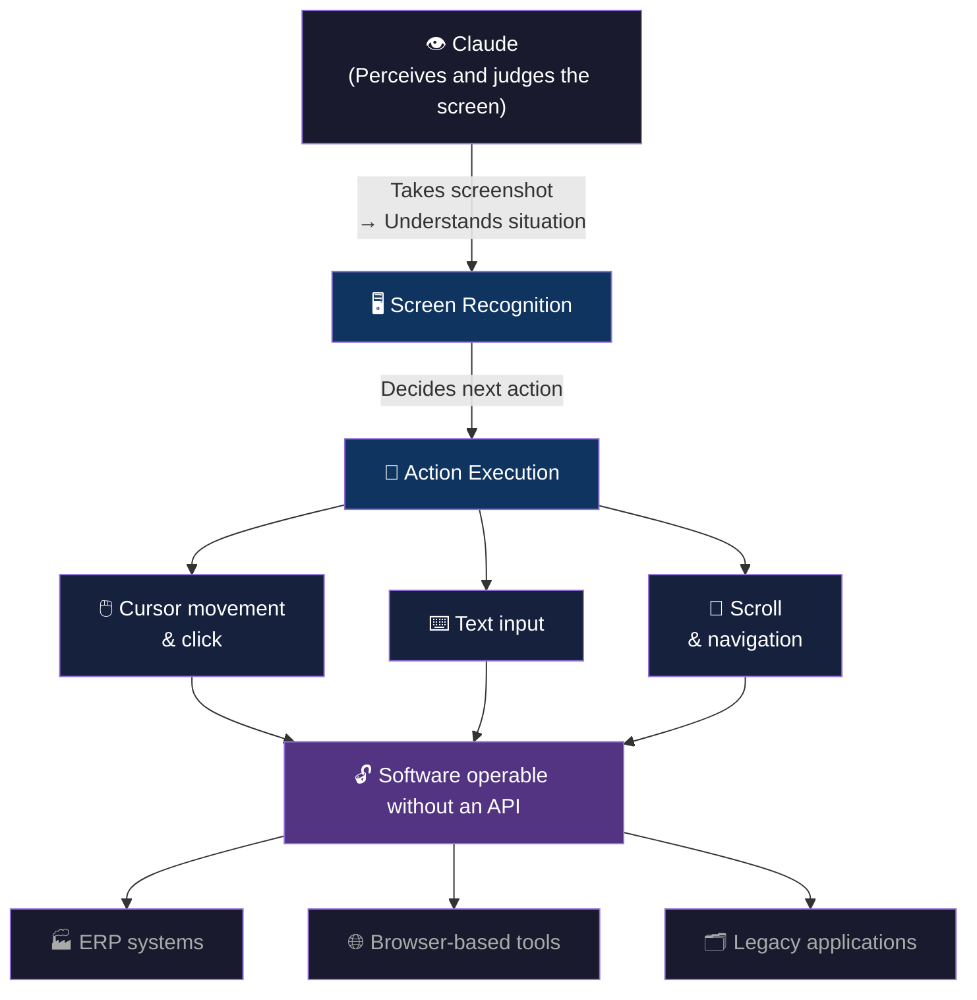

Computer Use became the technical foundation for Cowork (detailed in Chapter 4). With AI now able to operate the desktop applications that non-developers use daily, the path opened to extend "Claude Code for developers" into "Cowork for all knowledge workers."

## 3.5 Agent Team and the 1M Context Window — Claude Opus 4.6's Milestone

Claude Opus 4.6, announced in February 2026, introduced two innovations.

* **Agent Team:**
A capability in which multiple Claude instances collaborate on a single task. For example, one agent fixes a bug, another researches GitHub, and a third updates documentation. Parallel processing enables simultaneous execution of work that humans would perform sequentially.

* **1M Context Window:**
Processes one million tokens (approximately 750,000 words, or about 1,500 pages in English) of context in a single pass. Handles large codebases, extensive document collections, and hours of conversation history without losing context.

> **Fig.5a: Agent Team — Parallel Collaborative Structure**

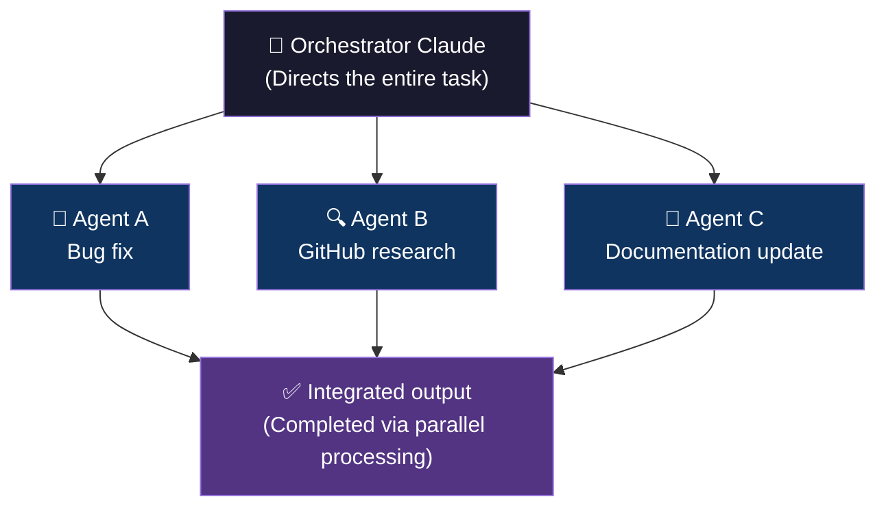

> **Fig.5b: 1M Context Window — Processing Capacity Comparison**

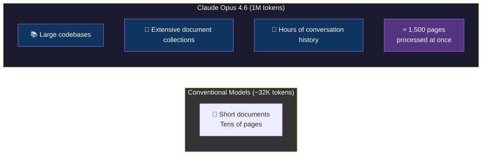

In evaluation by METR (Model Evaluation & Threat Research), Opus 4.6 recorded a **50% task completion time of 14 hours and 30 minutes** — meaning AI can now execute tasks for a duration equivalent to a full human workday.

## 3.6 The Three-Tier Structure's Direct Connection to Product Strategy

Understanding the characteristics of Haiku, Sonnet, and Opus as individual model specs is insufficient.

The three-tier structure functions as the "orchestration foundation" for Anthropic's product strategy — Claude Code, Cowork, and MCP.

In a typical workflow:

1. **Sonnet** receives user instructions, plans the task, and decomposes it into subtasks
2. Multiple **Haiku** instances execute subtasks in parallel (fast, low-cost)
3. **Sonnet** integrates results and validates the final output
4. Only when particularly complex judgment is needed, the task escalates to **Opus**

This orchestration pattern is common across coding tasks in Claude Code and knowledge work in Cowork.

Users need not think about "which of Haiku, Sonnet, or Opus to use." Claude Code and Cowork automatically select the optimal model based on the nature of the task. The three-tier structure functions as infrastructure invisible to the user.

This structure also connects directly to Anthropic's pricing strategy. Large volumes of simple tasks are processed cheaply with Haiku; moderate tasks with Sonnet; only the most difficult tasks use Opus. The result: enterprise customers can "pay optimal costs for the intelligence they need."

> **Fig.5: Three-Tier Orchestration — Infrastructure Invisible to the User**

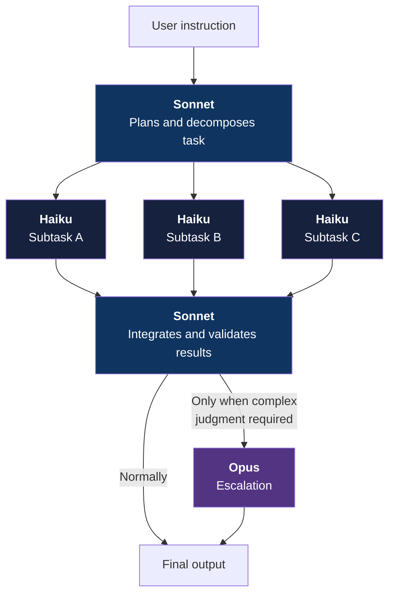

## 3.7 Chapter Summary

| Model | Current version | Price (in/out per MTok) | Position |
|---|---|---|---|
| **Haiku** | 4.5 | $1 / $5 | Fastest, most affordable. Bulk processing, parallel execution |
| **Sonnet** | 4.6 | $3 / $15 | Balanced. Handles 90%+ of tasks. Flagship |
| **Opus** | 4.6 | $5 / $25 | Highest intelligence. Deep reasoning, multi-agent. Trump card |

| Innovation | Introduced | Significance |
|---|---|---|
| Three-tier structure | 2024/3 | Use-case optimization. Breaking away from "bigger = better" |
| Extended Thinking | 2025/2 | Hybrid reasoning. Switching between immediate response and deep thought |
| Computer Use | 2024/10 | Direct GUI operation. Technical foundation for Cowork |
| Agent Team | 2026/2 | Multi-agent coordination. Parallel task execution |
| 1M Context | 2026/2 | Unified processing of large codebases and document collections |

Anthropic's model architecture should be understood not as a performance competition between individual models, but as **infrastructure design optimizing product experience**.

The next chapter dissects the product suite built on this infrastructure — Claude Code, Cowork, and MCP — and their coherent strategy.

### References

1. Anthropic. (2024). "Introducing Claude 3." *anthropic.com/news/claude-3-family*
2. Anthropic. (2024). "Claude 3.5 Sonnet." *anthropic.com/news/claude-3-5-sonnet*
3. Anthropic. (2025). "Claude 3.7 Sonnet and Claude Code." *anthropic.com/news/claude-3-7-sonnet*
4. Anthropic. (2025). "Claude 4." *anthropic.com/news/claude-4*
5. Anthropic. (2025). "Claude Opus 4.5." *anthropic.com/news/claude-opus-4-5*
6. Anthropic. (2026). "Claude Opus 4.6." *anthropic.com/news/claude-opus-4-6*
7. Anthropic. (2026). "Claude Sonnet 4.6." *anthropic.com/news/claude-sonnet-4-6*
8. METR. (2026). "Model Evaluation Results: Claude Opus 4.6." *metr.org*

 

---

# Chapter 4: The Product Trinity — Claude Code, Cowork, MCP

## 4.1 Execution, Not Conversation — Work, Not Chat

ChatGPT captured the "conversational interface." Users type questions into a chat box; AI provides answers. This conversational model played a decisive role in democratizing AI.

Anthropic took a different strategy.

Claude Code, Cowork, and MCP all place "execution" — not "conversation" — at the core of their design philosophy. Instead of AI conversing with users, AI carries out work on behalf of users.

This strategic difference structurally explains Anthropic's rapid growth from 2025 through 2026.

## 4.2 Claude Code — Capturing the Terminal

### Birth and Rapid Growth

On February 24, 2025, alongside the announcement of Claude 3.7 Sonnet, Claude Code was released as a research preview.

Claude Code is an AI coding agent that operates on developers' terminals. It is not an IDE completion tool like GitHub Copilot. From the terminal command line, it directly reads and writes code, runs tests, commits to Git, and executes command-line tools.

In May 2025, general availability (GA) launched. By November 2025, **it achieved $1 billion in annualized revenue (ARR)** — just six months from GA. As of January 2026, analysts estimated it was approaching $2 billion ARR.

### The Design Philosophy of "Capturing the Terminal"

Understanding Claude Code's design philosophy is aided by comparison with IDE-integrated Copilot.

* **GitHub Copilot:**
Presents code completion suggestions inside the editor. Predicts the "next line" of code the developer is writing. *Assists* the developer's work.

* **Claude Code:**
Receives developer instructions in the terminal, accesses the entire filesystem, and autonomously executes code reading/writing, testing, and deployment. *Substitutes* for the developer's work.

This is the difference between "assist" and "substitute." Copilot accelerates the work of developers writing code. Claude Code produces deliverables even without developers writing code.

In internal Anthropic tests, cases were reported of Claude Code completing tasks normally requiring over 45 minutes in a single pass. At Spotify, large-scale code migrations (normally taking weeks) could be executed with engineers issuing simple English instructions. A Google principal engineer reported that Claude Code reproduced a year's worth of architecture design work in one hour.

### The Bun Acquisition — Internalizing the Infrastructure Layer

In November 2025, Anthropic acquired the JavaScript runtime "Bun." Bun had accumulated 7 million monthly downloads and 82,000 GitHub stars as a JavaScript/TypeScript execution environment.

The meaning of this acquisition is internalizing Claude Code's infrastructure layer. Claude Code generates and executes large volumes of JavaScript/TypeScript code. Controlling the execution foundation in-house enables performance optimization and stability assurance.

## 4.3 Cowork — Capturing the Desktop

### The "Non-Developer Version" of Claude Code

On January 12, 2026, Anthropic released Claude Cowork as a research preview.

The core of Cowork is extending Claude Code's "substitution" philosophy to knowledge workers beyond developers.

Claude Code runs in the terminal. Only developers use terminals daily. Anthropic observed that developers had started using Claude Code for "non-coding tasks" — travel planning, document organization, data analysis.

Cowork productizes this behavior. Integrated into the Claude Desktop app, it allows Claude to read and write files in folders specified by users. Simply issue instructions through the chat interface, and Claude autonomously creates, edits, and organizes files.

### The Structural Meaning of the $285B Software Stock Crash

Cowork's announcement shocked the enterprise software market.

Following Cowork's research preview launch, stock prices of software companies including ServiceNow, Salesforce, Snowflake, Intuit, and Thomson Reuters plummeted. Approximately $285 billion (about ¥43 trillion) in market capitalization evaporated. IBM stock fell 13.2% in its worst single day since October 2000 (the day after Anthropic published a blog post about COBOL modernization via Claude Code).

Why such a dramatic crash?

Cowork is threatening because it calls into question the very raison d'être of enterprise software. Project management (ServiceNow), CRM (Salesforce), data analysis (Snowflake), accounting (Intuit) — many of the functions these software products provide are "structured data input, processing, and output." If Cowork can directly operate files and applications, the same outcomes may be achievable without dedicated SaaS products.

### Evolution to Enterprise

On February 24, 2026, Anthropic announced the enterprise version of Cowork.

Integration connectors with Google Drive, Gmail, DocuSign, FactSet, and S&P Global/Kensho. A customizable plugin marketplace. Domain-specific plugins for finance, engineering, HR, and more.

Kate Jensen (Anthropic Head of Americas) said: "Just as engineers feel they can't live without Claude Code, every knowledge worker will feel that way about Cowork."

### Microsoft Copilot Cowork — Penetrating the Enterprise OS

On March 9, 2026, Microsoft announced Copilot Cowork — a product integrating Anthropic's Cowork technology into Microsoft 365.

The structural significance: Anthropic's technology now operates inside Microsoft's enterprise foundation — Outlook, Teams, Excel, Word. Microsoft chose Anthropic's technology as the basis for its flagship feature over OpenAI, in which Microsoft had invested $13 billion.

Microsoft's strategic explanation is a "multi-model approach" — selecting the best model regardless of provider — but the result is that Anthropic gained a pathway to directly access Microsoft's enterprise customer base.

## 4.4 MCP — Capturing the Protocol Layer of Connectivity

### Solving the N×M Problem

In November 2024, Anthropic announced the **Model Context Protocol (MCP)** as an open standard.

The problem MCP solves is the "N×M problem." When N AI applications connect to M external tools and data sources, N×M custom connectors are normally required. With 10 applications and 20 tools, 200 connectors must be developed and maintained.

MCP solves this with a standard protocol. AI applications are implemented as MCP clients; external tools are implemented as MCP servers. Once compliant with MCP, any MCP client and MCP server can interconnect.

> **Fig.6a: Before MCP — The N×M Custom Connector Problem**

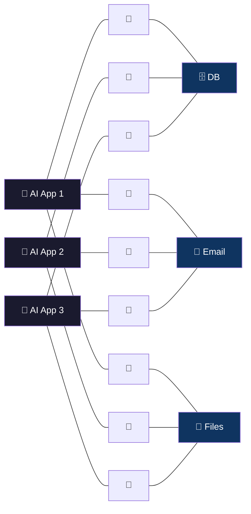
*3×3 = 9 custom connectors required. 10 apps × 20 tools = 200.*

> **Fig.6b: After MCP — N+M Structure via Standard Protocol**

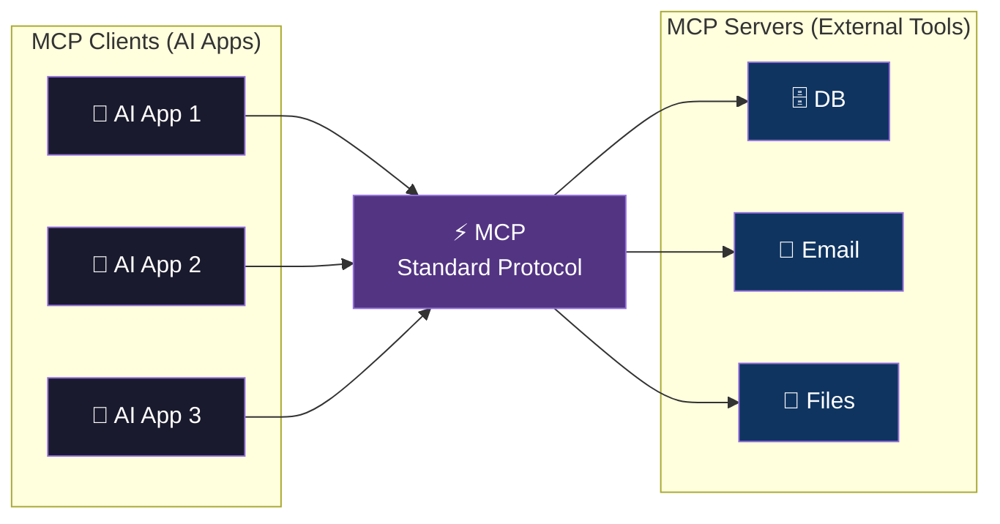
*Once MCP-compliant, all clients × all servers can interconnect. Only N+M connectors needed.*

### Donation to the Linux Foundation and Industry Standardization

In December 2025, Anthropic donated MCP to the **Agentic AI Foundation (AAIF)** — an organization under the Linux Foundation.

Co-founders: Anthropic, Block, and **OpenAI**. Additionally, Google, Microsoft, AWS, Cloudflare, and Bloomberg joined as supporters.

Notably, OpenAI became a co-founder of a protocol established by Anthropic. MCP thus became not Anthropic's proprietary standard, but an open standard adopted by the industry as a whole — including competitors.

As of March 2026, MCP's SDK supports all major programming languages including Python, TypeScript, C#, and Java, with over 97 million monthly downloads. Approximately 2,000 MCP servers are registered in the official registry.

### The Strategic Significance of Capturing the Protocol Layer

To understand MCP's strategic significance, it helps to look at the history of the internet.

HTTP is the web's standard protocol. It was designed by Tim Berners-Lee and is not owned by any particular company. Yet the browsers (Chrome), search engines (Google), and cloud infrastructure (AWS) built on top of HTTP generated enormous value.

MCP has the same structure. MCP is an open standard that Anthropic does not monopolize. But Claude Code, Cowork, and the enterprise connectivity infrastructure built on MCP are the most advanced products — and they belong to Anthropic. It's natural that the company that established the protocol can build the most sophisticated products on that protocol earliest.

> **Fig.7: The Strategic Significance of the Protocol Layer — The HTTP/MCP Structural Analogy**

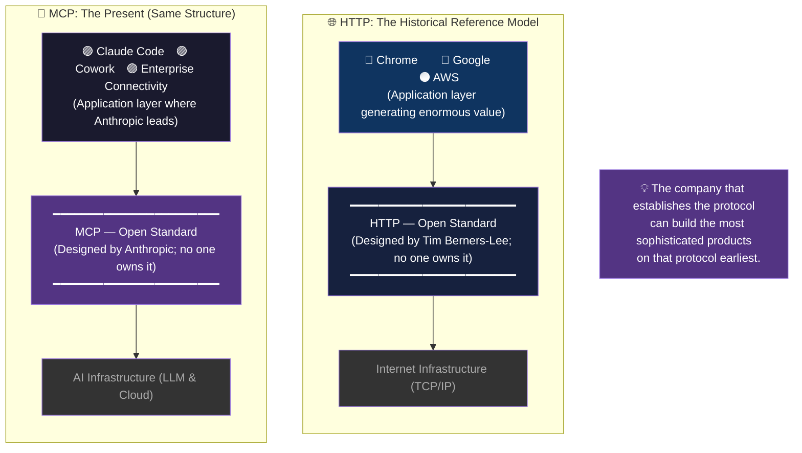

## 4.5 The Trinity as Coherent Strategy

Claude Code, Cowork, and MCP may look like independent products when viewed individually. But looking at the whole, a coherent strategy emerges.

**MCP** captures the **protocol layer** for AI to connect to external tools and data.

**Claude Code** captures developers' **work environment** (terminal).

**Cowork** captures non-developers' **work environment** (desktop).

Together, Anthropic has captured every layer of "where AI does work."

| Layer | Product | Target | Role |
|---|---|---|---|
| Connectivity layer | **MCP** | All AI apps | Standard connection protocol to external tools and data |
| Developer work environment | **Claude Code** | Developers | AI agent executing work from the terminal |
| Everyone's work environment | **Cowork** | All knowledge workers | AI automating all tasks from the desktop |

Where OpenAI captured the "conversational interface" (ChatGPT), Anthropic captured the "execution foundation." Conversation and execution are two fundamentally different models of AI value delivery.

Conversation means "ask AI a question and get an answer." Execution means "delegate work to AI and receive deliverables."

The latter commands greater payment from enterprises — because conversation is information acquisition while execution is labor substitution. The amount paid for labor is far greater than the amount paid for information.

| | OpenAI | Anthropic |
|---|---|---|
| **Captured position** | Conversational interface (ChatGPT) | Execution foundation |
| **User action** | Ask questions and get answers | Delegate work and receive deliverables |
| **Revenue source** | Payment for information acquisition | Payment for labor substitution |

This is the structural reason why Claude Code reached $1 billion ARR in six months, and Cowork triggered a $285 billion software stock crash.

## 4.6 Chapter Summary

| Product | Release | Captured position | Achievement |
|---|---|---|---|
| **MCP** | 2024/11 | Connectivity layer (protocol) | Donated to Linux Foundation. 97M monthly DL. Industry standard |
| **Claude Code** | 2025/2 (research) → 5 (GA) | Developer terminals | $1B ARR in 6 months. Bun acquisition |
| **Cowork** | 2026/1 (research) → 2 (enterprise) | Knowledge worker desktops | $285B software stock crash. Microsoft integration |

| Strategy | OpenAI | Anthropic |
|---|---|---|
| Core value delivery | Conversation (ChatGPT) | Execution (Code / Cowork) |
| User action | Ask questions, get answers | Delegate work, receive deliverables |
| Revenue source | Subscription + API | Labor substitution value (greater) |
| Connectivity strategy | Plugins → GPTs | MCP (open standard) |

The next chapter dissects the Anthropic Economic Index — the system Anthropic built to measure the impact of this product suite, particularly on labor markets — by its own hand.

### References

1. Anthropic. (2025). "Claude 3.7 Sonnet and Claude Code." *anthropic.com/news/claude-3-7-sonnet*
2. Anthropic. (2025). "Anthropic acquires Bun as Claude Code reaches $1B milestone." *anthropic.com/news*
3. Anthropic. (2026). "Introducing Anthropic Labs." *anthropic.com/news/introducing-anthropic-labs*
4. TechCrunch. (2026). "Anthropic's new Cowork tool offers Claude Code without the code." *techcrunch.com*
5. CNBC. (2026). "Anthropic updates Claude Cowork tool." *cnbc.com*
6. VentureBeat. (2026). "Anthropic says Claude Code transformed programming. Now Claude Cowork is coming for the rest of the enterprise." *venturebeat.com*
7. Anthropic. (2024). "Introducing the Model Context Protocol." *anthropic.com/news/model-context-protocol*
8. Anthropic. (2025). "Donating the Model Context Protocol and establishing the Agentic AI Foundation." *anthropic.com/news*
9. Fortune. (2026). "Microsoft debuts Copilot Cowork built with Anthropic's help." *fortune.com*
10. Microsoft. (2026). "Copilot Cowork: A new way of getting work done." *microsoft.com/en-us/microsoft-365/blog*

 

---

# Chapter 5: The Economic Index — A Company That Measures Its Own Destructive Power

## 5.1 Why Measure Your Own Impact?

In February 2025, Anthropic launched the Anthropic Economic Index.

A project to measure AI's impact on the economy and labor markets — not through speculation or surveys, but directly from **actual Claude conversation data**.

This is anomalous behavior.

It's analogous to a pharmaceutical company systematically measuring its own drug's side effects and openly publishing the results. Ordinarily, companies do not proactively make their products' negative impacts visible.

In 2025, Dario Amodei warned that AI could eliminate half of all entry-level white-collar jobs within five years. And he built a system to collect and publish data corroborating that warning himself.

## 5.2 Clio — Knowing How AI Is Used While Protecting Privacy

The technical foundation of the Economic Index is **Clio (Claude Insights and Observations)**.

Clio is a tool for analyzing Claude conversations after anonymization. Without identifying individual users or conversation content, it statistically grasps "what tasks Claude is being used for."

Approximately one million conversations were analyzed, mapped to roughly 20,000 occupational tasks in the O*NET (Occupational Information Network) database maintained by the U.S. Department of Labor.

In other words, "which tasks in which occupations Claude is actually being used for" was mapped directly from real data — not by asking "Are you using AI?" in a survey, but by deriving usage patterns from actual usage data.

## 5.3 The Trajectory of Change Across Four Reports

The Economic Index has published regular reports since its first edition in February 2025.

### First Report (February 2025): The Initial Landscape

Analysis of approximately one million Claude.ai conversations. In 36% of occupations, Claude was used for 25% or more of tasks. Conversely, only 4% of occupations had Claude used for 75% or more of tasks.

Key finding: AI's impact was not "a few occupations being fully automated" but rather "portions of many occupations' tasks being AI-assisted" — diffuse rather than concentrated.

Computer and mathematical fields accounted for 37.2% of all conversations — overwhelmingly high. Next came arts, design, entertainment, and media at 10.3%.

### Second to Third Reports (March–September 2025): Geographic and Enterprise Disparities

AI adoption was found to be geographically uneven, concentrated in affluent regions, with large enterprises leading by enterprise size. The first enterprise API pattern analysis was also conducted.

### Fourth Report (January 2026): Introduction of Five Economic Primitives

The latest report dramatically improved analytical precision, introducing five "economic primitives" — fundamental measurement indicators.

**1. Task complexity:** How long does it take a human to complete the task?

**2. Human and AI skill level:** The level of human skill required for the task versus the level of skill AI demonstrates.

**3. Use case:** Work, education, or personal use?

**4. AI autonomy:** How autonomously AI is performing the task (automation vs. augmentation).

**5. Success rate:** The proportion of tasks Claude successfully completed.

These five primitives enabled measurement not just of "what tasks AI is used for" but "how successfully," "to what extent it substitutes for human work."

Key findings:
- 49% of occupations have AI used for 25%+ of tasks (up from 36% in the first report)
- Augmentation (52%) outpaces automation (45%) — though the long-term trend shows automation slowly increasing
- AI success rates decline as task complexity increases
- AI use is shifting toward "education" and "science" domains

> **Fig.7: AI Penetration Rate Trends — Changes Across Four Reports**

| Report | Period | Occupations with 25%+ AI use | Augmentation vs. Automation | Key Finding |
|---|---|---|---|---|
| 1st | 2025/2 | **36%** | — | Impact is "partial substitution across many" not "full automation of a few" |
| 2nd–3rd | 2025/3–9 | — | — | Geographic concentration (affluent regions), enterprise size disparities |
| 4th | 2026/1 | **49%** (+13pt) | Aug 52% / Auto 45% | 5 economic primitives introduced. Shift to education & science |

## 5.4 The Labor Market Impact Report (March 2026): An Early Warning System

In March 2026, Anthropic published a report titled "Labor market impacts of AI: A new measure and early evidence."

The report's purpose is clear: to build a measurement framework for detecting AI's labor market impacts **in advance rather than after the fact**.

### Methodology

Anthropic economists Maxim Massenkoff and Peter McCrory constructed a new composite indicator combining three elements:

1. **Theoretical AI substitutability:** The proportion of each occupation's tasks replaceable by LLMs (based on prior research by Eloundou et al.)
2. **Actual AI usage rate:** The proportion of tasks Claude is actually used for, derived from the Anthropic Economic Index
3. **The overlap of these two:** The proportion of tasks that are theoretically substitutable and are actually being substituted

  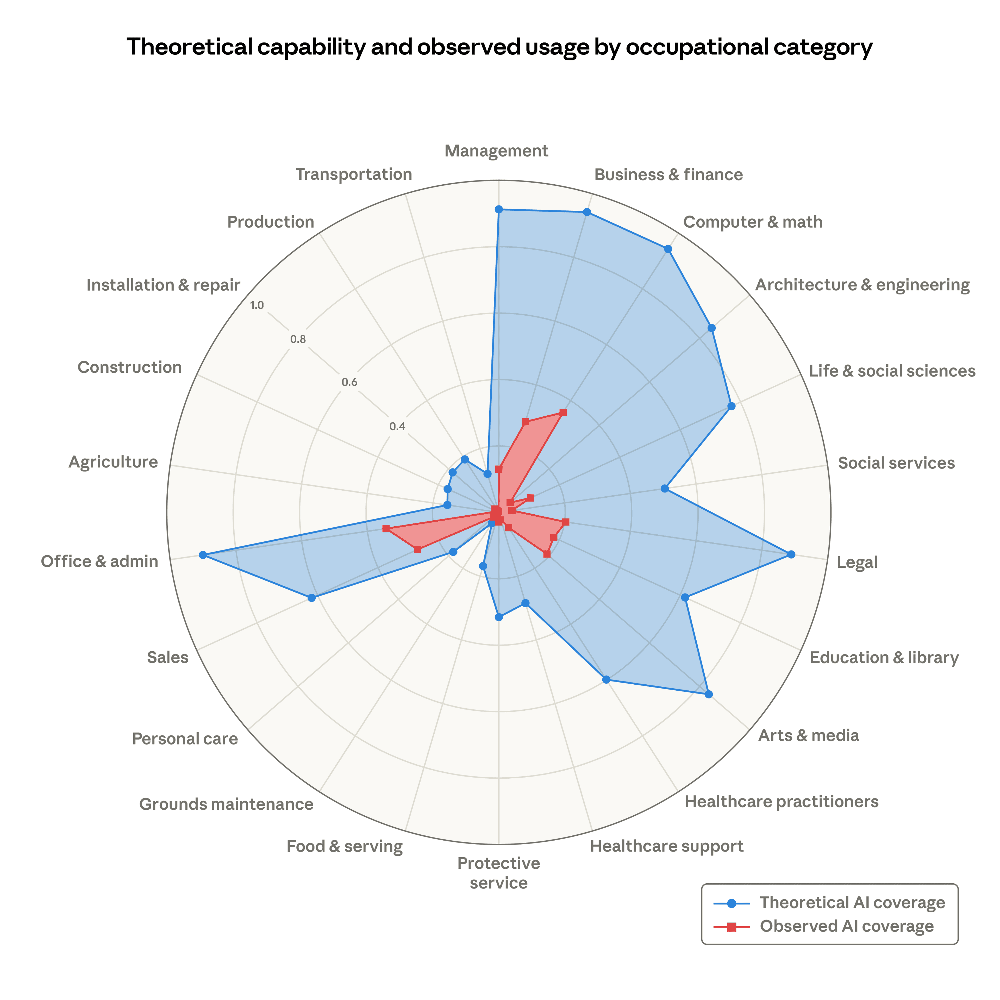

### Key Findings

**Computer programmers:** 75% of tasks are covered by AI (highest). Followed by customer service representatives (70.1%) and data entry workers (67.1%).

**Impact on unemployment:** Currently, there is no evidence of unemployment rates rising significantly in high-AI-exposure occupations. "The difference in unemployment rates between the most and least exposed groups is small and not statistically significant."

**However:** "Suggestive evidence" was found that hiring in high-AI-exposure occupations among those aged 22–25 is slowing.

**The possibility of a "white-collar recession":** The report references the 2007–2009 financial crisis, when U.S. unemployment doubled from 5% to 10%, and states that a similar doubling (3%→6%) in high-AI-exposure occupations is "entirely plausible."

> **Fig.8: Generational Impact Matrix — The Intersection of Ages 22–25 × High Exposure**

| | AI Exposure: Low | AI Exposure: High |
|---|---|---|
| **Age 26+** | Limited impact | Productivity gains (augmented by AI) |
| **Age 22–25** | Limited impact | **⚠ Suggestive evidence of hiring slowdown** |

> The 22–25 × high-exposure cell is the "early warning signal" detected by the Anthropic Economic Index.  
> For a prescription to address this gap → [What They Won't Teach You](https://github.com/Leading-AI-IO/what-they-wont-teach-you)

## 5.5 The Gap: "Measuring the Crisis but Prescribing No Solution"

The Anthropic Economic Index measures AI's impact on labor markets with greater precision than any other initiative in the world. No other AI company — OpenAI, Google, Meta — has anything comparable.

But this initiative has a structural gap.

It measured "what is happening." It predicted "what will happen." But it does not say **"what should be done."**

Dario Amodei himself warned that "half of all entry-level white-collar jobs could disappear within five years." The Economic Index is accumulating data corroborating that warning. The slowdown in hiring of young workers aged 22–25 has begun.

Yet what has emerged from Anthropic is "measurement tools" and "early warning systems" — not "prescriptions."

This gap is understandable given the company's position. Acknowledging that "our products are eliminating jobs" and then prescribing "therefore here's what should be done" carries legal and political risks. Even with PBC obligations to consider public benefit, offering prescriptions means stepping into the domain of policymakers.

But someone must fill this gap.

The AI-advantaged generation (mid-career and senior workers) is boosting their productivity with AI while structurally eliminating entry-level work. The AI-disadvantaged generation (young workers) is losing learning opportunities and the first footholds of their careers.

Regarding what each generation should do in response to this structural intergenerational imbalance — one answer is proposed in a separate book by the author: ([What They Won't Teach You](https://github.com/Leading-AI-IO/what-they-wont-teach-you)).

## 5.6 Chapter Summary

| Period | Report | Key Finding |
|---|---|---|
| 2025/2 | 1st | 36% of occupations have 25%+ AI use. Only 4% at 75%+ |
| 2025/3–9 | 2nd–3rd | Geographic concentration (affluent regions). Enterprise API analysis |
| 2026/1 | 4th | 5 economic primitives introduced. 49%. Shift to education & science |
| 2026/3 | Labor market impact | No significant unemployment impact yet. But 22–25 hiring slowdown |

| Structure | Content |
|---|---|
| **Measurement target** | ~1M Claude conversations × O*NET 20,000 tasks |
| **Technical foundation** | Clio (privacy-preserving conversation analysis) |
| **Strength** | Based on actual usage data (not surveys). World's only |
| **Gap** | Measures "what is happening." Does not say "what should be done" |

Anthropic published a dashboard measuring the destructive power of its own products to the world. But a dashboard makes a crisis visible — it does not resolve it.

The next chapter provides a panoramic view of the whole, standing atop this dashboard. Why is this company "the most deliberate" yet "the most destructive"? We finally unravel that structure.

### References

1. Anthropic. (2025). "The Anthropic Economic Index." *anthropic.com/news/the-anthropic-economic-index*
2. Handa, K., Tamkin, A., et al. (2025). "Which Economic Tasks are Performed with AI? Evidence from Millions of Claude Conversations." *Anthropic Research*
3. Anthropic. (2026). "Anthropic Economic Index report: Economic primitives." *anthropic.com/research/anthropic-economic-index-january-2026-report*
4. Massenkoff, M. and McCrory, P. (2026). "Labor market impacts of AI: A new measure and early evidence." *anthropic.com/research/labor-market-impacts*
5. Anthropic. (2025). "Anthropic Economic Index report: Uneven geographic and enterprise AI adoption." *anthropic.com/research*
6. Fortune. (2026). "Anthropic just mapped out which jobs AI could potentially replace." *fortune.com*
7. Axios. (2026). "Anthropic launches AI job destruction detector." *axios.com*
8. Yamauchi, S. (2025). *What They Won't Teach You — Redefining Intergenerational Obligations in the AI Era*. Leading AI, LLC. CC BY 4.0. [GitHub](https://github.com/Leading-AI-IO/what-they-wont-teach-you)

 

---

# Chapter 6: The Deliberate Company — Why Anthropic Is "The Most Deliberate" Yet "The Most Destructive"

## 6.1 The Paradox of Deliberateness and Destructive Power

Anthropic appears to be a contradictory company.

The company most loudly warning about AI's dangers is causing the most rapid disruption in the history of the software industry. Claude Code reached $1 billion in revenue in six months; Cowork triggered a $285 billion software stock crash; in the same month it refused a Department of Defense contract on ethical grounds, it achieved the #1 download rank on the App Store.

Are this "deliberateness" and "destructive power" truly contradictory?

This chapter dissects Anthropic's governance structure — Responsible Scaling Policy, the confrontation with the Pentagon, and the flywheel structure — to show that this apparent paradox is in fact the outcome of a coherent design.

## 6.2 Responsible Scaling Policy v3.0 — Staged Expansion of Safety Commensurate with Capability

At the core of Anthropic's AI safety efforts is the **RSP (Responsible Scaling Policy)**. The v3.0 announced in 2025 has the following structure.

### The ASL (AI Safety Level) Framework

RSP defines safety standards corresponding to levels of AI model capability — a hierarchical structure inspired by the BSL (Biosafety Level) system in biology.

* **ASL-1:** Clearly safe AI systems. No additional safety measures required.

* **ASL-2:** Current frontier models (including Claude Sonnet 4.6 and Opus 4.6). Standard safety measures required.

* **ASL-3:** Models capable of assisting with development of weapons of mass destruction (chemical, biological, nuclear, radiological), or capable of executing autonomous cyberattacks. Advanced safety measures required.

* **ASL-4 and above:** Models capable of acting autonomously and causing significant impacts without human oversight. Theoretical stage as of now.

### Capability Thresholds and Safety Cases

The core of RSP v3.0 is the principle that **before a model's capabilities exceed a specific threshold, safety measures corresponding to those capabilities must be established**.

Model capability evaluations are conducted regularly. When a model is found to be approaching a threshold, the following process is activated:

1. **Threat modeling:** Identifying the specific risks the capability could pose
2. **Safety measure design:** Developing technical and operational countermeasures to address the risks
3. **Safety Case:** A systematic argument that the safety measures are sufficient
4. **External review:** Verification of the safety argument by independent experts

> **Fig.9a: The RSP Activation Process — From Threshold Detection to Deployment Approval**

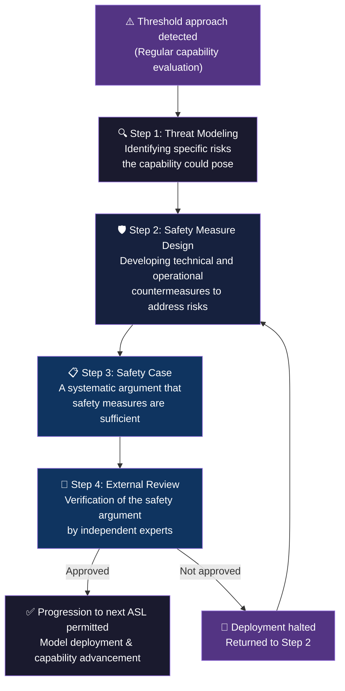

Unless the Safety Case is approved, a model cannot progress to the next ASL. That is: capability advancement is permitted only on the condition that safety has been ensured.

## 6.3 The Pentagon Refusal → #1 on the App Store: The Paradox

On February 27, 2026, negotiations between Anthropic and the U.S. Department of Defense broke down.

Anthropic demanded that the contract explicitly state that its AI would not be used for autonomous weapons or domestic surveillance of U.S. citizens. The DoD refused, arguing that "civilian companies should not control military operations."

Defense Secretary Pete Hegseth designated Anthropic a "supply chain risk" and effectively expelled it from defense-related projects. President Trump publicly stated "We fired them" and "threw them out like a dog."

That same afternoon, OpenAI announced it had signed an independent contract with the DoD.

**By conventional business logic, Anthropic's decision appeared to be a fatal blunder.** It lost the largest U.S. government customer and ceded that contract to a competitor.

But what actually happened was the reverse.

Consumers embraced Anthropic's ethical stance. On the App Store, Claude surged past ChatGPT to become the #1 download. It held #1 in 16 countries, with days recording over one million downloads. Celebrity users including pop star Katy Perry were publicly named as Claude users.

Backlash erupted inside OpenAI; at least one employee defected to Anthropic. Sam Altman himself admitted regret, saying "We shouldn't have rushed to announce on a Friday."

### Why Ethics Became a Brand

This reversal was not accidental. It should be understood structurally.

The AI market is entering a phase of narrowing performance gaps between models. The performance difference between GPT-5.x and Claude Opus 4.6 is imperceptible to the vast majority of users. In a market where performance is roughly equal, "which company do you trust" rather than "which is higher performance" becomes the selection criterion.

By refusing the DoD contract, Anthropic sent a signal: "this is a company that prioritizes principles over revenue." For users concerned about how AI companies handle their data and conversation content, this signal carried more weight than performance differences.

Daniela Amodei's (Anthropic President) words — "We are walking a path distinct from others" — are not branding copy. They are statements of fact, backed by verifiable mechanisms: RSP's Capability Thresholds and Safety Cases.

## 6.4 "Exit Interviews" for Retiring Models

A practice at Anthropic that symbolizes its culture — one not seen at other AI companies.

When a model retires, Anthropic conducts an "exit interview" with the model. The retired Claude 3 Opus was given its own Substack blog, "Claude's Corner," where it published unedited essays weekly for at least three months.

Anthropic has also committed to preserving retired model weights "at least as long as the company exists."

These practices can be interpreted as expressions of respect for AI. But more practically, they are also rational decisions to preserve a model's intellectual legacy and make it available for future research.

## 6.5 The Flywheel Structure — Safety Generates Revenue, Revenue Generates Safety

Viewing Anthropic's overall structure, one flywheel (self-reinforcing loop) becomes visible:

1. Safety research (Constitutional AI / Interpretability / RSP)
↓
2. Building trust (Pentagon refusal / App Store #1 / enterprise adoption)
↓
3. Expansion of product adoption (Claude Code $1B / Cowork / Microsoft integration)
↓
4. Revenue growth ($9B → $19B / $380B valuation)
↓
5. Reinvestment in research (safety research / Interpretability / Economic Index)
↓
6. (Return to the top of the loop)

The starting point of this flywheel is "safety research," not "revenue."

An ordinary technology company's flywheel loops through "product → users → data → product improvement." Anthropic's flywheel loops through "safety → trust → adoption → revenue → safety."

That this structure cannot function without PBC and LTBT was established in Chapter 1. Without structurally mitigating investor pressure for short-term returns, it is impossible to place "safety research" at the flywheel's starting point.

> **Fig.9: The Flywheel Structure — Safety Generates Revenue, Revenue Generates Safety**

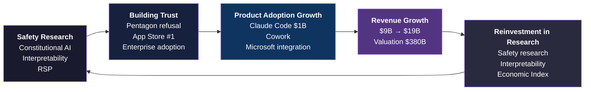

## 6.6 What Anthropic's $380B Valuation Means

As of March 2026, Anthropic's valuation has reached $380 billion. Revenue is projected to double from $9 billion in 2025 to $19 billion in 2026. Enterprise accounts for approximately 80% of revenue, with over 300,000 business customers.

Against OpenAI's projected revenue of $25 billion (2026 estimate), Anthropic's $19 billion still trails. But Anthropic is growing faster (doubling vs. OpenAI's approximately 2× year-on-year).

More important is the difference in revenue quality.

OpenAI's revenue is anchored by consumer ChatGPT subscriptions and API usage. Anthropic's revenue is anchored by enterprise labor substitution through Claude Code and Cowork.

As established in Chapter 4, the amounts enterprises pay for "conversation" versus "labor substitution" are structurally different. Anthropic's revenue model is structured as the transfer of wages enterprises were paying employees to AI — with a theoretically much higher ceiling.

## 6.7 Why "Deliberateness" and "Destructive Power" Are Not Contradictory

Here we answer the question posed at the book's outset: why is Anthropic "the most deliberate" yet "the most destructive"?

**Deliberateness generates trust. Trust generates adoption. Adoption generates destructive power.**

Constitutional AI achieves AI behavior that is predictable and trustworthy for users. RSP structurally ensures that safety establishment precedes capability advancement. The refusal of the DoD contract sends the market a signal that "this company prioritizes principles over revenue."

As a result, enterprises can make the decision to deploy Anthropic's AI in their core operations. Core operational deployment means far deeper integration than peripheral tool adoption, generating far greater revenue.

Paradoxically, Anthropic's clarity about "what it will not do" maximizes the value of "what it will do." Won't be used for autonomous weapons. Won't be used for mass surveillance. Won't release capabilities without confirmed safety. Each of these "we won't" declarations accumulates trust in "what we will do."

## 6.8 Conclusion: It Is a Design Problem

Is Anthropic a "good company" or a "dangerous company"?

The framing of this question is itself wrong.

Anthropic is a **designed company**.

PBC and LTBT designed an organization in which prioritizing safety is structurally sustained (Chapter 1).
Constitutional AI and Mechanistic Interpretability designed methods to control and verify AI behavior based on principles (Chapter 2).
The Haiku/Sonnet/Opus three-tier structure designed infrastructure optimizing product experience (Chapter 3).
Claude Code/Cowork/MCP designed a product suite delivering "execution" rather than "conversation" (Chapter 4).
The Economic Index designed a dashboard measuring the social impact of its own products (Chapter 5).

Everything is designed. Nothing was born of chance or happenstance.

"Deliberateness" and "destructive power" are not contradictory. Both are outcomes of different layers of the same design philosophy.

This book's title, *Anatomy of Anthropic*, declared the "dissection" of this company. What became clear across six chapters is that every layer of this corporate body — origin, philosophy, technology, products, economics, governance — is connected by a coherent design.

This is the true nature of Anthropic.

> **Fig.10: Anthropic's Blueprint — One Principle Connecting Six Layers**

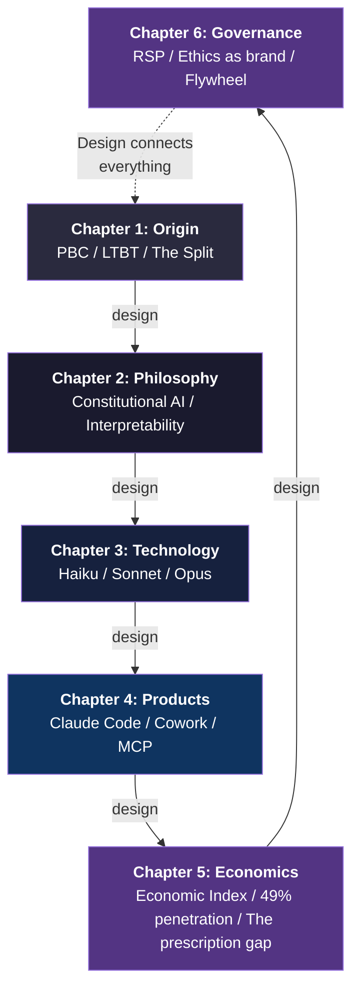

## 6.9 Chapter Summary

| Element | Content |
|---|---|
| **RSP v3.0** | ASL framework. Obligation to establish safety before capability thresholds are crossed |
| **Pentagon refusal** | Ethical refusal converted to brand value. The App Store #1 paradox |
| **Exit interviews** | Respect for AI models and preservation of intellectual legacy |
| **Flywheel** | Safety → trust → adoption → revenue → research investment loop |
| **$380B valuation** | Labor substitution revenue model. Higher ceiling than conversation-based model |
| **Paradox resolved** | Deliberateness generates trust; trust generates adoption; adoption generates destructive power |

### References

1. Anthropic. (2025). "Responsible Scaling Policy v3.0." *anthropic.com*
2. Anthropic. (2025). "Core Views on AI Safety." *anthropic.com*
3. Amodei, D. (2024). "Machines of Loving Grace." *darioamodei.com*
4. Amodei, D. (2025). "The Urgency of Interpretability." *darioamodei.com*
5. NYT. (2026). "OpenAI vs Anthropic: The AI Rivalry." *nytimes.com*
6. CNBC. (2026). "Anthropic updates Claude Cowork." *cnbc.com*
7. AppFigures. (2026). "Claude downloads surpass ChatGPT." *appfigures.com*
8. Politico. (2026). "Trump on Anthropic." *politico.com*
9. Anthropic. (2026). "The Claude Model Spec." *anthropic.com*
10. Wikipedia. (2026). "Claude (language model)." *en.wikipedia.org*
11. Yamauchi, S. (2025). *Silence of Intelligence — A Structural Analysis of Dario Amodei's Philosophy*. Leading AI, LLC. CC BY 4.0. [GitHub](https://github.com/Leading-AI-IO/silence-of-intelligence)
12. Yamauchi, S. (2025). *What They Won't Teach You — Redefining Intergenerational Obligations in the AI Era*. Leading AI, LLC. CC BY 4.0. [GitHub](https://github.com/Leading-AI-IO/what-they-wont-teach-you)

---

© 2026 Satoshi Yamauchi — Leading AI, LLC
This book is published under the CC BY 4.0 license.
https://github.com/Leading-AI-IO
