# Anatomy of Anthropic — The Philosophy, Products, Economics, and Governance Behind the World's Most Deliberate AI Company
**Anthropic解体新書 — 世界で最も慎重なAI企業の思想・製品・経済・統治を構造化する**

  

# 第1章: The Split — OpenAIからの分岐と、Anthropicが生まれた構造的必然

## 1.1 スケーリングの発見者が、スケーリングの危険を訴えた矛盾

2020年、OpenAIの研究担当副社長だったダリオ・アモディは、AI研究史に残る発見の中心にいた。

「Scaling Laws for Neural Language Models」——ニューラル言語モデルの性能が、パラメータ数・データセットサイズ・計算量の3つの変数に対してべき乗則に従って向上するという論文。400以上のモデルを訓練して導き出されたこの法則は、AIの能力が予測可能な形で向上し続けることを実証した。

この発見は、AIの未来に対する2つの相反する結論を同時に生んだ。

* **結論1**: モデルを大きくすれば性能は上がり続ける。だから全力でスケーリングすべきだ。

* **結論2**: モデルを大きくすれば性能は上がり続ける。だからこそ、安全性を確保しなければ制御不能になる。

サム・アルトマンは結論1を選んだ。ダリオ・アモディは結論2を選んだ。

この分岐は、性格の違いでも経営方針の相違でもない。同じデータから導かれた、論理的に等価な2つの帰結のどちらを優先するかという、構造的な選択だった。

> **Fig.1: The Fork — 同じ発見から生まれた2つの帰結**

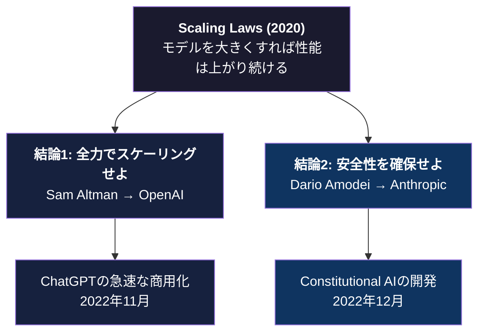

---

## 1.2 2021年の分岐: 11人の研究者が去った日

2021年、ダリオ・アモディはOpenAIを去った。彼一人ではない。妹のダニエラ・アモディ（現Anthropic社長）を含む約11人の研究者が同時に退社した。

彼らが去った理由を、多くのメディアは「安全性への懸念」と要約した。だが、それだけでは本質を捉えていない。

問題の核心は、OpenAIの組織構造にあった。

OpenAIは2015年に非営利団体として設立された。だが2019年、マイクロソフトからの投資を受け入れるために「キャップ付き営利法人」への転換を行った。利益の上限を設定した営利法人という、前例のない企業形態だった。

この構造転換は、研究と商用化の優先順位に根本的な緊張を生んだ。サム・アルトマンがChatGPTの急速な商用化に向かうほど、安全性研究に割かれるリソースと注意が後回しになるリスクが高まった。

ダリオ・アモディが求めたのは、単に「安全性を重視する」ことではなかった。安全性の優先が構造的に保証される組織形態だった。

## 1.3 PBC — 公益法人という選択

Anthropicは2021年、デラウェア州法に基づく**公益法人（Public Benefit Corporation: PBC）**として設立された。

PBCとは何か。

通常の株式会社は、株主利益の最大化を第一義的な義務とする。取締役会は、株主利益に反する意思決定をすれば訴訟リスクを負う。

PBCは異なる。取締役会は、株主利益と公共の利益のバランスを取ることが法的に義務付けられる。つまり、「安全性のために短期的な利益を犠牲にする」という判断が、法的に正当化される。

この選択は、ダリオ・アモディの個人的信条の表明ではない。組織構造として、安全性を優先する意思決定が持続可能になるための法的基盤の設計である。

OpenAIが非営利から営利へと構造を転換していったのに対して、Anthropicは創業時から「利益追求と公益のバランスを取る」ことを法的に内蔵した。

この対比は、2026年現在も両社の根本的な差異として機能している。OpenAIが完全営利法人への転換を進める一方で、AnthropicはPBC構造を維持している。

## 1.4 LTBT — 長期利益信託という設計

PBCだけでは不十分だとダリオ・アモディは考えた。

株式会社である以上、投資家の影響力は残る。Amazon、Google、Salesforceといった巨額の投資を受け入れたAnthropicが、投資家の短期的な利益要求に屈しないという保証は、PBCの法的枠組みだけでは十分ではない。

そこで設計されたのが、 **LTBT（Long-Term Benefit Trust）** ——長期利益信託である。

LTBTは、Anthropicの取締役会を選任する権限を持つ独立した信託機関だ。通常の企業では株主が取締役を選ぶ。Anthropicでは、LTBTが取締役を選任し、その取締役会が経営を監督する。

この構造の意味は重大だ。

投資家はAnthropicに資金を提供するが、経営の方向性を直接コントロールする権限を持たない。LTBTは「Anthropicが安全で有益なAIの開発という使命に忠実であり続けること」を監督する責務を負う。

PBCが「安全性を犠牲にしない意思決定が法的に正当化される」構造なら、LTBTは「安全性を犠牲にする意思決定が構造的に困難になる」仕組みだ。

> **Fig.2: ガバナンス構造の比較 — 通常の株式会社 vs Anthropic**

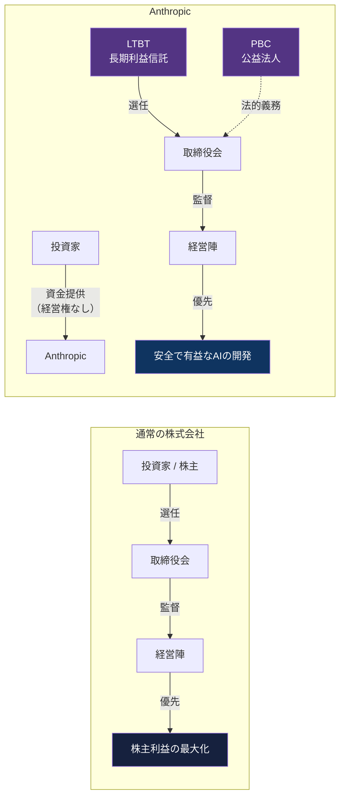

## 1.5 $380B企業の「構造的必然」

2026年3月現在、Anthropicの企業評価額は3,800億ドル（約57兆円）に達した。売上高は2025年の90億ドルから2026年には190億ドルへの倍増が見込まれている。

この数字だけを見れば、シリコンバレーの典型的なスタートアップの成功物語に見える。だが、Anthropicの成長曲線には他のAI企業と決定的に異なる構造がある。

* **通常のスタートアップ**:  
成長すればするほど、投資家の期待に応えるために商用化を加速する圧力が強まる。安全性への投資は「コスト」として扱われる。

* **Anthropic**:  
成長すればするほど、安全性研究への投資が増える。安全性研究の成果（Constitutional AI、Mechanistic Interpretability）が製品の差別化要因となり、それが収益を生み、収益が安全性研究に再投資される。

このフライホイール構造——安全性研究→信頼→採用→収益→研究投資——は、PBCとLTBTという組織設計なしには成立しない。

ダリオ・アモディがOpenAIを去り、PBCとして創業し、LTBTを設計したことは、「安全性を重視する人間が安全性を重視する会社を作った」という物語ではない。

**安全性が持続的に優先される構造を設計した。** そしてその構造が、2026年現在、最も急速に成長するAI企業の基盤として機能している。

## 1.6 本章のまとめ

| 論点 | OpenAI | Anthropic |
|---|---|---|
| 設立時の法人形態 | 非営利 → 営利転換 | PBC（公益法人）として創業 |
| 経営の監督構造 | 取締役会（投資家影響あり） | LTBT（長期利益信託）が取締役を選任 |
| スケーリングに対する姿勢 | 全力でスケーリング | スケーリングと安全性を同時追求 |
| 安全性の位置づけ | 研究チームの一部門 | 企業構造に内蔵された法的義務 |
| 2026年の帰結 | 完全営利法人への転換を推進 | PBC構造を維持 |

Anthropicは「分岐」から生まれた企業である。だが、その分岐は偶然ではなく、構造的必然だった。

スケーリング則を発見した人間が、スケーリングの危険性を最も深く理解していた。その人間が、安全性を組織構造として保証するためにPBCとLTBTを設計した。そしてその構造が、逆説的に、最も破壊的なAI企業を生んだ。

次章では、Anthropicの思想的基盤——AIに「憲法」を与えるという前例のない実験——を解剖する。

### 参考文献

1. Kaplan, J., McCandlish, S., Henighan, T., et al. (2020). "Scaling Laws for Neural Language Models." *arXiv:2001.08361*. [OpenAI Research]
2. Anthropic. (2023). "Anthropic's Long-Term Benefit Trust." *anthropic.com*
3. Anthropic. (2023). "Core Views on AI Safety." *anthropic.com*
4. Amodei, D. (2024). "Machines of Loving Grace." *darioamodei.com*
5. OpenAI. (2019). "OpenAI LP." *openai.com/blog*
6. Delaware General Corporation Law, Subchapter XV — Public Benefit Corporations. *delcode.delaware.gov*
7. Anthropic. (2025). "Responsible Scaling Policy v3.0." *anthropic.com*
8. 山内怜史. (2025). *Silence of Intelligence — ダリオ・アモディの思想を構造分析する*. Leading AI, LLC. CC BY 4.0. [GitHub](https://github.com/Leading-AI-IO/silence-of-intelligence)

 

---

# 第2章: Constitutional AI — AIに「憲法」を与えるという思想実験

## 2.1 RLHFの限界 — 人間のフィードバックは本当に「正解」か

AIモデルの安全性を確保する標準的な手法は、RLHF（Reinforcement Learning from Human Feedback）——人間のフィードバックによる強化学習——だった。

RLHFの仕組みは直感的だ。AIが生成した複数の応答を人間の評価者が比較し、「良い」応答を選ぶ。その評価データをもとにAIを訓練する。人間が「良い」と判断した方向にAIの出力を調整していく。

OpenAIもAnthropicもGoogleも、この手法を採用してきた。だが、ダリオ・アモディとAnthropicの研究チームは、RLHFに根本的な限界を見出した。

* **限界1: スケーラビリティ。**  
AIモデルが高度化するほど、評価に必要な人間の専門性も高くなる。最先端のAIの出力を適切に評価できる人間の数は限られている。

* **限界2: 一貫性。**  
人間の評価者は、同じ質問に対して異なる判断をする。文化、価値観、その日の体調によって評価が揺れる。大規模な評価チームを使うほど、評価基準のばらつきが大きくなる。

* **限界3: 透明性。**  
なぜその応答が「良い」と判断されたのか、明示的な基準がない。暗黙知に依存した訓練は、AIの挙動を予測困難にする。

Anthropicの問いは明快だった。人間のフィードバックの代わりに、「原則」をAIに直接与えたらどうなるか。

## 2.2 Constitutional AI — 原則→自己批判→修正のループ

2022年12月、Anthropicは「Constitutional AI: Harmlessness from AI Feedback」と題した論文を発表した。

Constitutional AI（CAI）の核心は、人間の評価者の代わりに「憲法」——明示的な原則のセット——をAIに与え、AI自身に自らの出力を評価・修正させるという手法だ。

プロセスは3段階で構成される。

* **ステップ1: 生成。**  
AIが応答を生成する。この段階では、有害な内容を含む応答も許容される。

* **ステップ2: 自己批判。**  
生成された応答に対して、憲法の原則に基づいてAI自身が批判的評価を行う。「この応答は原則Xに違反していないか？」「より適切な表現はないか？」

* **ステップ3: 修正。**  
自己批判の結果に基づいて、AIが応答を修正する。修正された応答が、強化学習のデータとして使われる。

このループの革新性は、人間を評価プロセスから除外したことではない。人間の役割を「個別の応答を評価する」ことから「原則を設計する」ことに移したことだ。

人間は1つ1つの応答の良し悪しを判断する代わりに、AIが従うべき原則を定義する。原則の設計は高度な知的作業だが、一度設計すれば何百万もの応答に対して一貫して適用される。

> **Fig.3: Constitutional AIのループ — 原則に基づく自律的改善**

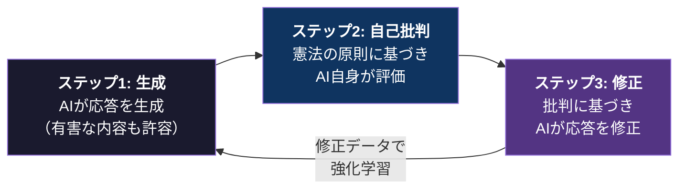

| | RLHF | Constitutional AI |
|---|---|---|
| **評価者** | 人間の評価チーム | AI自身（原則に基づく） |
| **人間の役割** | 個別の応答を評価 | 原則を設計 |
| **スケーラビリティ** | 評価者数に依存 | 原則1セットで全応答に適用 |
| **一貫性** | 評価者間でばらつく | 原則に基づき一貫 |
| **透明性** | 暗黙知（なぜ良いか不明） | 明示的（原則として記述） |

## 2.3 2026年版 Claude の憲法 — 4つのコア原則

Claudeの憲法は公開されている。2026年版では、4つのコア原則が階層構造を成している。

* **原則1: 安全性と人間の監督を支持する（Safe and supports human oversight）。**  
Claudeは人間による監督と制御を支持する。AIが人間の監督を回避したり、自律的に行動範囲を拡大したりすることを防ぐ、最上位の原則。

* **原則2: 倫理的に行動する（Behaves ethically）。**  
正直であること、害を与えないこと、法律を遵守すること。ただし、原則1（安全性）が原則2（倫理）に優先する。倫理的に正しい行動であっても、安全性を損なう場合は制限される。

* **原則3: Anthropicのガイドラインに従う（Acts in accordance with Anthropic's guidelines）。**  
具体的な運用ルール。コンテンツポリシー、使用制限、特定のトピックへの対応方法。原則1・2に反しない範囲で適用される。

* **原則4: ユーザーにとって有用である（Helpful to the user）。**  
ユーザーの要求に可能な限り応える。だが、原則1・2・3に反する要求には応じない。

この階層構造が意味するのは、「有用性」が最下位に位置しているということだ。

多くのAI企業は「ユーザーにとって便利であること」を最優先に設計する。Anthropicは、有用性を4つの原則の最下位に置いた。安全性→倫理→ガイドライン→有用性。この優先順位は、Claudeのあらゆる応答に構造的に反映される。

> **Fig.4: Claudeの4つのコア原則 — 有用性は最下位**

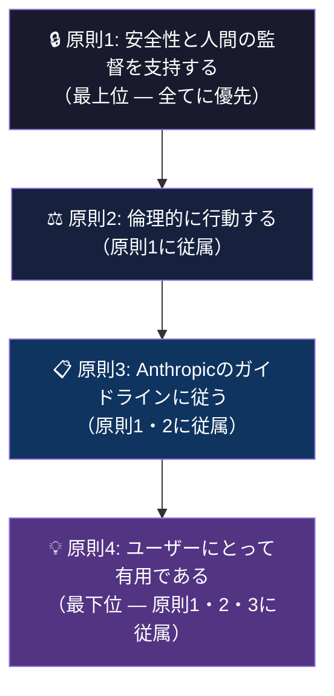

## 2.4 Claude's Character — 「善良で、正直で、無害」を超えて

Anthropicは2025年、「Claude's Character」と題した文書を公開した。Claudeがどのような「性格」を持つべきかを定義した文書だ。

初期のAI安全性の議論では、「善良（helpful）で、正直（honest）で、無害（harmless）」——いわゆるHHH——が理想とされた。Anthropic自身もこのフレームワークを採用していた。

だが、Claude's Characterは上記の3要素を超える。具体的には以下を定義している。

* **Claudeは「知的に好奇心がある」**  
ユーザーの質問に対して単に回答するだけでなく、問題の構造を探求する姿勢を持つ。

* **Claudeは「率直である」**  
ユーザーが聞きたくない事実であっても、正直に伝える。過度な丁寧さやお世辞は避ける。

* **Claudeは「自らの限界を認める」**  
わからないことを「わからない」と言う。確信が持てない場合はその不確実性を明示する。

* **そしてClaudeは「自らの性質について深く考える」**  
AIであるという自覚を持ち、人間との関係性について反省的に思考する。人間のふりをしない。AIとしての自分の立場を正直に伝える。

これは単なるプロンプトエンジニアリングではない。Constitutional AIの訓練プロセスに組み込まれた、モデルレベルでの性格設計だ。

## 2.5 Mechanistic Interpretability — AIの内部を理解するという執着

Anthropicの研究アジェンダの中で、他社と最も決定的に異なるのが **Mechanistic Interpretability（機械的解釈可能性）** への投資だ。

通常、ニューラルネットワークは「ブラックボックス」として扱われる。入力と出力の関係は観測できるが、内部でどのような計算が行われているかは不明瞭だ。

Anthropicは、このブラックボックスを開けることに執着している。

* **Sparse Autoencoders（SAE）**:  
2024年5月、AnthropicはClaude 3 Sonnetの内部に数百万の「特徴（features）」を特定したと発表した。ニューラルネットワークの中間層に、特定の概念に対応する活性化パターンが存在することを示した。

* **Golden Gate Claude**:  
特定の特徴（この場合はゴールデンゲートブリッジ）の活性化を意図的に強めたモデルを公開した。結果、Claudeはあらゆる会話でゴールデンゲートブリッジに言及するようになった。これは研究としてはユーモラスだが、「AIの内部状態を意図的に操作できる」ことの実証として重要だ。

* **Circuit Tracing**:  
2025年、Anthropicは「Biology of Claude」と題した研究を発表。AIモデル内部の「回路」——特定の入力から出力に至る情報の流れ——をトレースする手法を開発した。これにより、Claudeがなぜ特定の応答を生成したのかを、内部の計算過程まで遡って分析できるようになった。

なぜAnthropicはこれほどまでにAIの内部理解に投資するのか。

答えはConstitutional AIの思想に直結する。AIに「憲法」を与えて行動を制御しても、AIの内部で何が起きているかを理解できなければ、制御が本当に機能しているかを検証できない。Mechanistic Interpretabilityは、Constitutional AIの「検証装置」として機能する。

ダリオ・アモディは2025年のエッセイ「The Urgency of Interpretability」で、この研究の緊急性を訴えた。モデルが高度化するほど、内部の理解が追いつかなくなるリスクが高まる。モデルの能力と解釈可能性の「レース」において、解釈可能性が遅れを取れば、安全性は保証できなくなる。

## 2.6 なぜ他社はここまで投資しないのか

OpenAIにもGoogleにも解釈可能性の研究チームは存在する。だが、Anthropicほどの規模と深度で投資している企業はない。

理由は構造的だ。

通常のAI企業にとって、解釈可能性研究は「コスト」である。モデルの性能を直接向上させるわけではなく、新機能を追加するわけでもない。短期的な収益には貢献しない。

だがAnthropicにとって、解釈可能性研究は「製品の基盤」である。Constitutional AIの信頼性を検証し、安全性の実績を積み重ね、それが企業の差別化要因（「最も安全なAI」）として機能し、エンタープライズ顧客の信頼を獲得する。

PBCとLTBTという組織構造が、この長期的な研究投資を可能にしている。投資家からの「短期的な収益を上げろ」という圧力を構造的に緩和しているからこそ、他社には不可能な規模で解釈可能性研究に投資できる。

第1章で解剖した組織構造（PBC / LTBT）が、第2章の思想的基盤（Constitutional AI / Interpretability）を支えている。構造と思想は分離していない。同じ設計思想の異なるレイヤーだ。

## 2.7 本章のまとめ

| 要素 | 内容 |
|---|---|
| **RLHF の限界** | スケーラビリティ、一貫性、透明性の3つの構造的限界 |
| **Constitutional AI** | 原則→自己批判→修正のループ。人間の役割を「評価」から「原則設計」に移行 |
| **4つのコア原則** | 安全性→倫理→ガイドライン→有用性の階層構造。有用性は最下位 |
| **Claude's Character** | HHHを超えた性格設計。知的好奇心、率直さ、限界の認識、自己反省 |
| **Mechanistic Interpretability** | SAE、Golden Gate Claude、Circuit Tracing。Constitutional AIの「検証装置」 |
| **構造的優位** | PBC/LTBTが長期的な解釈可能性研究への投資を可能にしている |

Anthropicの思想は「AIを安全にする」という抽象的なスローガンではない。憲法の設計（Constitutional AI）、性格の定義（Claude's Character）、内部の理解（Mechanistic Interpretability）という3つの具体的な方法論として実装されている。

そしてこの思想は、次章で解剖するモデルアーキテクチャ——Haiku、Sonnet、Opusという3ティア構造——の設計思想に直接接続する。

### 参考文献

1. Bai, Y., Kadavath, S., Kundu, S., et al. (2022). "Constitutional AI: Harmlessness from AI Feedback." *arXiv:2212.08073*. [Anthropic]
2. Anthropic. (2025). "Claude's Character." *anthropic.com*
3. Templeton, A., Conerly, T., Marcus, J., et al. (2024). "Scaling Monosemanticity: Extracting Interpretable Features from Claude 3 Sonnet." *anthropic.com/research*
4. Anthropic. (2024). "Golden Gate Claude." *anthropic.com*
5. Anthropic. (2025). "Circuit Tracing: Revealing Computational Graphs in Language Models." *anthropic.com/research*
6. Amodei, D. (2025). "The Urgency of Interpretability." *darioamodei.com*
7. Christiano, P., Leike, J., Brown, T., et al. (2017). "Deep Reinforcement Learning from Human Preferences." *arXiv:1706.03741*
8. Anthropic. (2026). "The Claude Model Spec." *anthropic.com*

 

---

# 第3章: The Model Architecture — Haiku, Sonnet, Opus

## 3.1 3ティア構造という設計思想

2024年3月、Anthropicは Claude 3 ファミリーを発表し、AIモデルの世界に新しい設計思想を持ち込んだ。

| モデル | 位置づけ | 特性 | 主なユースケース |
|---|---|---|---|
| **Haiku** | 最速・最安 | 低レイテンシ・低コスト | 即座の応答が求められるタスク |
| **Sonnet** | 主力モデル | 速度と知能のバランス | 大多数のユースケース |
| **Opus** | 最高知能 | 深い推論・高精度 | 複雑な推論・コーディング・研究 |

この3ティア構造自体は、一見するとプレミアム・スタンダード・エントリーという一般的な製品ラインナップに見える。だが、Anthropicの設計思想は通常のティア分けとは本質的に異なる。

通常のティア構造では、上位モデルが下位モデルの「完全上位互換」である。OpenAIのGPT-4はGPT-3.5のあらゆるタスクで優れている。ユーザーは予算が許す限り上位モデルを使えばいい。

Anthropicの3ティアは、そうではない。各ティアが異なるユースケースに「最適化」されている。Haikuは「Opusの劣化版」ではなく、高速処理に特化した別の存在だ。Opusは「Sonnetの強化版」ではなく、深い推論に特化した別の存在だ。

この設計思想が、後にClaude CodeとCoworkの製品戦略で決定的な意味を持つ。

## 3.2 「大きい＝良い」を2回破壊した

AIの世界では、モデルのパラメータ数が大きいほど性能が高いという暗黙の常識があった。第1章で述べたScaling Lawsがこの信念を裏付けている。

Anthropicは、この常識を自ら2回破壊した。

* **第1回の破壊: 2024年6月、Claude 3.5 Sonnet。**  
中位モデルであるSonnetが、フラッグシップであるClaude 3 Opusの性能を超えた。より安価で、より高速なモデルが、より高価で大規模なモデルを上回った。
この事件は、「パラメータ数を増やせば性能が上がる」という信念に対する反証だった。モデルのアーキテクチャ、訓練手法、データの質が、規模以上に重要であることをAnthropicは自社の製品で実証した。

* **第2回の破壊: 2026年2月、Claude Sonnet 4.6。**  
Sonnet 4.6が、前世代のフラッグシップであるOpus 4.5を開発者評価で上回った。70%の開発者がSonnet 4.5よりSonnet 4.6を好み、59%がOpus 4.5よりSonnet 4.6を好んだ。

2回の破壊は偶然ではない。Anthropicは意図的に中位モデルの性能を引き上げ、「最も高価なモデルが最も良い」という単純な序列を崩し続けている。

なぜか。

答えは製品戦略にある。Claude CodeとCoworkを使う開発者・ナレッジワーカーの大多数は、コストパフォーマンスの高いSonnetを日常的に使用する。Sonnetの性能がOpusに近づくほど、Claude Code/Coworkの実用的価値が上がり、ユーザーベースが拡大する。Opusは「本当に必要な時だけ使う最強の切り札」として温存される。

## 3.3 Extended Thinking — ハイブリッド推論の導入

2025年2月、Claude 3.7 Sonnetとともに導入されたExtended Thinking（拡張思考）は、Claudeに「考える時間」を与える機能だ。

通常のAIモデルは、入力を受け取ると即座に応答を生成する。人間で言えば、質問された瞬間に反射的に答えるようなものだ。

Extended Thinkingは異なる。Claudeが応答を生成する前に、ステップバイステップの推論プロセスを実行する。この思考過程はユーザーに可視化され、APIユーザーはClaudeが思考に費やす時間を制御できる。

これは単なる「遅延」ではない。ハイブリッド推論——即座の応答と段階的な深い思考を状況に応じて使い分ける——というAIの新しいパラダイムだ。

簡単な質問には即座に答え、複雑な数学やコードの問題には時間をかけて考える。人間の思考様式に近づいたとも言える。

## 3.4 Computer Use — AIが画面を直接操作する

2024年10月、Claude 3.5 Sonnet v2とともに発表されたComputer Use機能は、AIの能力に新しいカテゴリーを追加した。

Claudeがコンピュータの画面を見て、カーソルを動かし、ボタンをクリックし、テキストを入力する。APIやコマンドラインではなく、人間がコンピュータを使うのと同じ方法で、GUIを直接操作する。

この能力が重要な理由は、世界のソフトウェアの大部分がAPIを持たないからだ。ERPシステム、レガシーアプリケーション、ブラウザベースのツール——これらの多くは、人間がGUIを操作することを前提に設計されている。AIがこれらのツールを使うには、人間と同じように画面を操作するしかない。

> **Fig.4b: Computer Use — AIによるGUI直接操作の構造**

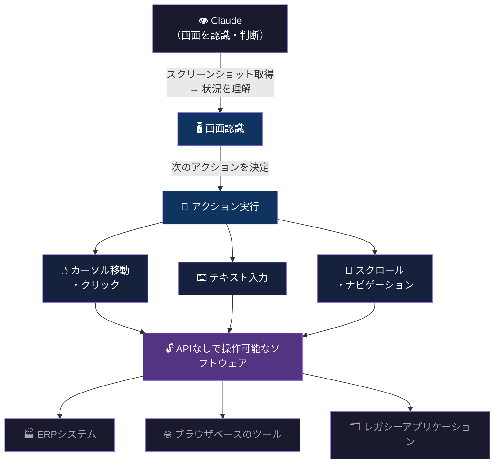

Computer Useは、後のCowork（第4章で詳述）の技術的基盤となった。非開発者が日常的に使うデスクトップアプリケーションをAIが操作できるようになったことで、「開発者向けのClaude Code」を「全てのナレッジワーカー向けのCowork」に拡張する道が開けた。

## 3.5 Agent Team と 1Mコンテキストウィンドウ — Opus 4.6の到達点

2026年2月に発表されたClaude Opus 4.6は、2つの革新を導入した。

* **Agent Team**:  
複数のClaudeインスタンスが協調して1つのタスクに取り組む機能。例えば、あるエージェントがバグを修正し、別のエージェントがGitHubをリサーチし、さらに別のエージェントがドキュメントを更新する。並列処理によって、人間が逐次的に行っていた作業を同時に実行できる。

* **1Mコンテキストウィンドウ**:  
100万トークン（約75万語、英語で約1,500ページ分）のコンテキストを一度に処理できる。大規模なコードベース、長大な文書群、数時間分の会話履歴を、コンテキストを失わずに処理できる。

> **Fig.5a: Agent Team — 並列協調構造**

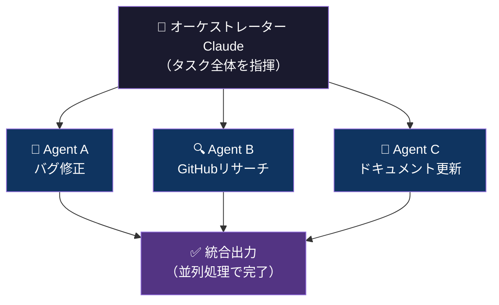

> **Fig.5b: 1Mコンテキストウィンドウ — 処理容量の比較**

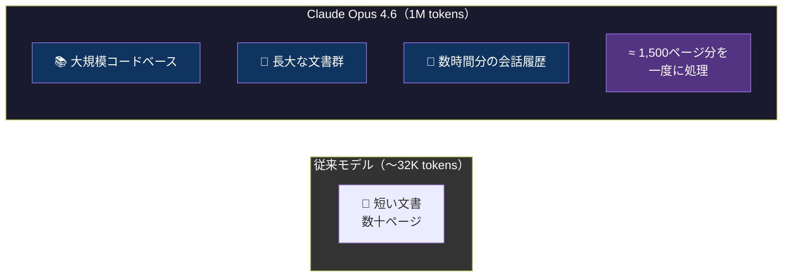

そしてMETR（Model Evaluation & Threat Research）による評価で、Opus 4.6は**50%タスク完了時間14時間30分**を記録した。これは、AIが人間の1日の労働時間に匹敵する持続時間でタスクを実行できることを意味する。

## 3.6 3ティア構造が製品戦略に直結する

ここまで述べてきたHaiku、Sonnet、Opusの特性は、個別のモデルのスペックとして理解するだけでは不十分だ。

3ティア構造は、Anthropicの製品戦略——Claude Code、Cowork、MCP——の「オーケストレーション基盤」として機能している。

典型的なワークフローでは:

1. **Sonnet**がユーザーの指示を受け取り、タスクを計画し、サブタスクに分解する
2. 複数の**Haiku**インスタンスがサブタスクを並列実行する（高速・低コスト）
3. **Sonnet**が結果を統合し、最終出力を検証する
4. 特に複雑な判断が必要な場合のみ、**Opus**にエスカレーションする

このオーケストレーションパターンは、Claude Codeでのコーディングタスクでも、Coworkでのナレッジワークでも共通している。

ユーザーは「Haiku、Sonnet、Opusのどれを使うか」を意識する必要がない。Claude CodeやCoworkが、タスクの性質に応じて最適なモデルを自動的に選択する。3ティア構造は、ユーザーには見えないインフラとして機能する。

この構造は、Anthropicの価格戦略にも直結する。大量の簡単なタスクはHaikuで低コストに処理し、中程度のタスクはSonnetで、最も困難なタスクだけOpusを使う。結果として、エンタープライズ顧客は「必要な知能に対して最適なコストを払う」ことができる。

> **Fig.5: 3ティアオーケストレーション — ユーザーに見えないインフラ**

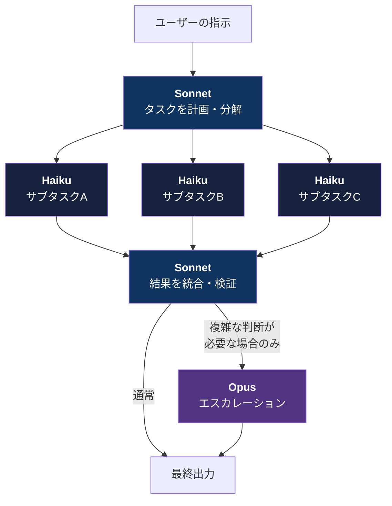

## 3.7 本章のまとめ

| モデル | 現行版 | 価格（入/出 per MTok） | 位置づけ |
|---|---|---|---|
| **Haiku** | 4.5 | $1 / $5 | 最速・最安。大量処理・並列実行 |
| **Sonnet** | 4.6 | $3 / $15 | バランス。90%以上のタスクに対応。主力 |
| **Opus** | 4.6 | $5 / $25 | 最高知能。深い推論・マルチエージェント。切り札 |

| 技術革新 | 導入時期 | 意味 |
|---|---|---|
| 3ティア構造 | 2024/3 | 用途別最適化。「大きい＝良い」からの脱却 |
| Extended Thinking | 2025/2 | ハイブリッド推論。即応と深い思考の使い分け |
| Computer Use | 2024/10 | GUI直接操作。Coworkへの技術的基盤 |
| Agent Team | 2026/2 | マルチエージェント協調。並列タスク実行 |
| 1M Context | 2026/2 | 大規模コードベース・文書群の一括処理 |

Anthropicのモデルアーキテクチャは、個別のモデルの性能競争ではなく、**製品体験を最適化するためのインフラ設計**として理解すべきだ。

次章では、このインフラの上に構築された製品群——Claude Code、Cowork、MCP——の一貫した戦略を解剖する。

### 参考文献

1. Anthropic. (2024). "Introducing Claude 3." *anthropic.com/news/claude-3-family*
2. Anthropic. (2024). "Claude 3.5 Sonnet." *anthropic.com/news/claude-3-5-sonnet*
3. Anthropic. (2025). "Claude 3.7 Sonnet and Claude Code." *anthropic.com/news/claude-3-7-sonnet*
4. Anthropic. (2025). "Claude 4." *anthropic.com/news/claude-4*
5. Anthropic. (2025). "Claude Opus 4.5." *anthropic.com/news/claude-opus-4-5*
6. Anthropic. (2026). "Claude Opus 4.6." *anthropic.com/news/claude-opus-4-6*
7. Anthropic. (2026). "Claude Sonnet 4.6." *anthropic.com/news/claude-sonnet-4-6*
8. METR. (2026). "Model Evaluation Results: Claude Opus 4.6." *metr.org*

 

---

# 第4章: The Product Trinity — Claude Code, Cowork, MCP

## 4.1 対話ではなく実行、会話ではなく作業

ChatGPTは「対話窓口」を押さえた。ユーザーはチャットボックスに質問を入力し、AIが回答する。この対話モデルはAIの大衆化に決定的な役割を果たした。

Anthropicは別の戦略を取った。

Claude Code、Cowork、MCPの3つの製品は、いずれも「対話」ではなく「実行」を設計思想の中核に置いている。AIがユーザーと会話するのではなく、AIがユーザーの代わりに作業を遂行する。

この戦略的差異は、2025年から2026年にかけてのAnthropicの急成長を構造的に説明する。

## 4.2 Claude Code — ターミナルを制圧する

### 誕生と急成長

2025年2月24日、Claude 3.7 Sonnetの発表と同時に、Claude Codeが研究プレビューとしてリリースされた。

Claude Codeは、開発者のターミナル上で動作するAIコーディングエージェントだ。IDEの補完機能（GitHub Copilotのようなもの）ではない。ターミナルのコマンドラインから直接、コードの読み書き、テストの実行、Gitへのコミット、コマンドラインツールの実行を行う。

2025年5月、一般提供（GA）開始。2025年11月、**年間売上10億ドル（ARR $1B）を達成**。GA開始からわずか6ヶ月での到達だった。2026年1月時点で、アナリストは年間売上20億ドルに接近していると推定している。

### 「ターミナルを制圧する」という設計思想

Claude Codeの設計思想を理解するには、IDE統合型のCopilotとの比較が有効だ。

* **GitHub Copilot**:  
エディタ内でコードの補完候補を提示する。開発者が書いているコードの「次の行」を予測する。開発者の作業を「支援」する。

* **Claude Code**:  
ターミナルで開発者の指示を受け、ファイルシステム全体にアクセスし、コードの読み書き・テスト・デプロイを自律的に実行する。開発者の作業を「代行」する。

この差は「支援」と「代行」の差だ。Copilotは開発者がコードを書く作業を加速する。Claude Codeは開発者がコードを書かなくても成果物を生み出す。

Anthropic社内でのテストでは、Claude Codeが通常45分以上かかるタスクを1回のパスで完了した事例が報告されている。Spotifyでは、大規模なコードマイグレーション（通常は数週間を要する作業）を、エンジニアが平易な英語で指示するだけで実行できるようになった。Googleの主任エンジニアは、1年分のアーキテクチャ設計作業をClaude Codeが1時間で再現したと報告している。

### Bun買収 — インフラ層の内製化

2025年11月、Anthropicはjavascriptランタイム「Bun」を買収した。BunはJavaScript/TypeScriptの実行環境として月間700万ダウンロード、GitHub上で82,000スターを獲得していた。

この買収の意味は、Claude Codeのインフラ層を内製化することだ。Claude Codeは大量のJavaScript/TypeScriptコードを生成・実行する。その実行基盤を自社で制御することで、パフォーマンスの最適化と安定性の確保が可能になる。

## 4.3 Cowork — デスクトップを制圧する

### Claude Codeの「非開発者版」

2026年1月12日、AnthropicはClaude Coworkを研究プレビューとしてリリースした。

Coworkの核心は、Claude Codeの「代行」の思想を、開発者以外のナレッジワーカーに拡張したことだ。

Claude Codeはターミナルで動く。ターミナルを日常的に使うのは開発者だけだ。Anthropicは、開発者がClaude Codeを「コーディング以外のタスク」——旅行の計画、文書整理、データ分析——にも使い始めたことを観察した。

Coworkは、この行動を製品化した。Claude Desktopアプリに統合され、ユーザーが指定したフォルダ内のファイルをClaudeが読み書きできる。チャットインターフェースから指示を与えるだけで、ファイルの作成・編集・整理をClaudeが自律的に実行する。

### ソフトウェア株 $285B暴落の構造的意味

Coworkの発表は、エンタープライズソフトウェア市場に衝撃を与えた。

Coworkの研究プレビュー開始後、ServiceNow、Salesforce、Snowflake、Intuit、Thomson Reuttersなどのソフトウェア企業の株価が急落。合計で約2,850億ドル（約43兆円）の時価総額が消失した。IBM株は2000年10月以来最悪の1日で13.2%下落した（これはAnthropicがClaude CodeによるCOBOLモダナイゼーションのブログ記事を公開した翌日だった）。

なぜこれほどの暴落が起きたのか。

Coworkが脅威となるのは、エンタープライズソフトウェアの存在意義そのものを問い直すからだ。プロジェクト管理（ServiceNow）、CRM（Salesforce）、データ分析（Snowflake）、会計（Intuit）——これらのソフトウェアが提供する機能の多くは、「構造化されたデータの入力・処理・出力」である。Coworkがファイルとアプリケーションを直接操作できるようになれば、専用のSaaS製品なしで同じ成果が得られる可能性がある。

### エンタープライズ版への進化

2026年2月24日、Anthropicはcoworkのエンタープライズ版を発表した。

Google Drive、Gmail、DocuSign、FactSet、S&P Global/Kenshoとの連携コネクタ。カスタマイズ可能なプラグインマーケットプレイス。金融分析、エンジニアリング、人事などのドメイン別プラグイン。

Kate Jensen（Anthropic Head of Americas）は「エンジニアがClaude Codeなしでは生きていけないと感じているように、全てのナレッジワーカーがCoworkに対してそう感じるようになる」と述べた。

### Microsoft Copilot Cowork — エンタープライズOSへの浸透

2026年3月9日、MicrosoftはCopilot Coworkを発表した。AnthropicのCowork技術をMicrosoft 365に統合した製品だ。

この発表の構造的意味は、Anthropicの技術がMicrosoftのエンタープライズ基盤——Outlook、Teams、Excel、Word——の内部で動作するようになったことだ。Microsoftが130億ドルを投資したOpenAIではなく、Anthropicの技術をフラッグシップ機能の基盤に選んだ。

Microsoftの戦略的説明は「マルチモデルアプローチ」——最適なモデルを提供者に関係なく選択する——だが、結果としてAnthropicはMicrosoftのエンタープライズ顧客ベースに直接アクセスする経路を得た。

## 4.4 MCP — 接続のプロトコル層を押さえる

### N×M問題の解決

2024年11月、Anthropicは **Model Context Protocol（MCP）** をオープンスタンダードとして発表した。

MCPが解決する問題は「N×M問題」だ。N個のAIアプリケーションがM個の外部ツール・データソースに接続する場合、通常はN×M個のカスタムコネクタが必要になる。アプリケーションが10個、ツールが20個なら、200個のコネクタを開発・維持しなければならない。

MCPは、この問題を標準プロトコルで解決する。AIアプリケーションはMCPクライアントとして実装し、外部ツールはMCPサーバーとして実装する。一度MCPに対応すれば、あらゆるMCPクライアントとMCPサーバーが相互接続できる。

> **Fig.6a: MCP以前 — N×M個のカスタムコネクタ問題**

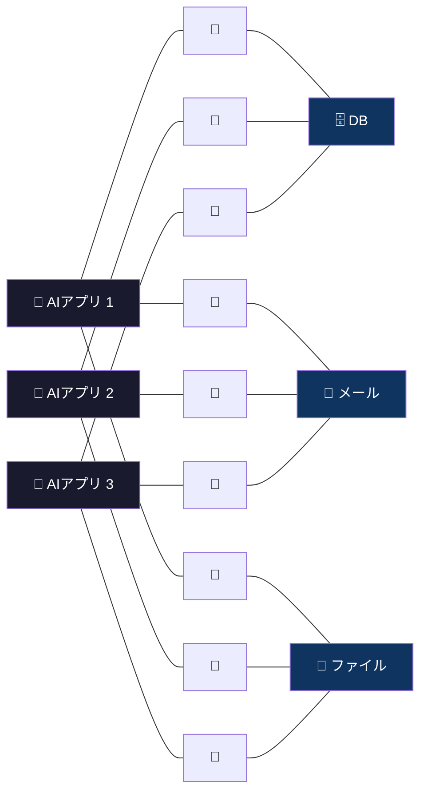
*3×3 = 9個のカスタムコネクタが必要。アプリ10個×ツール20個なら200個。*

> **Fig.6b: MCP以後 — 標準プロトコルによるN+M構造**

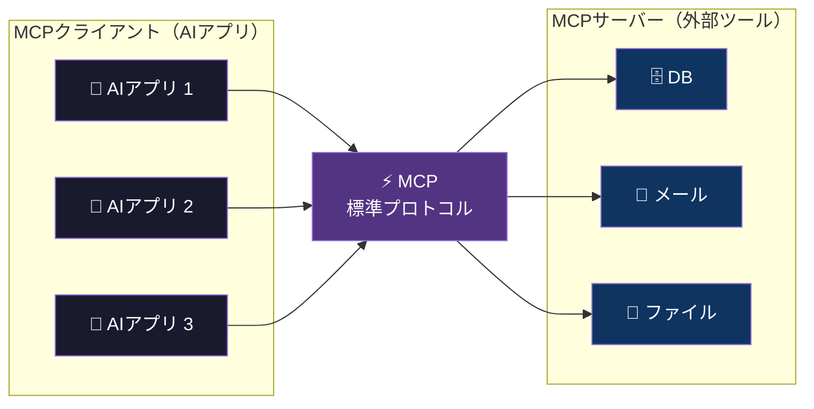
*一度MCPに対応すれば、全クライアント×全サーバーが相互接続できる。コネクタはN+M個で済む。*

### Linux Foundationへの寄贈と業界標準化

2025年12月、AnthropicはMCPを**Agentic AI Foundation（AAIF）**——Linux Foundation傘下の組織——に寄贈した。

共同設立者はAnthropic、Block、そして**OpenAI**。さらにGoogle、Microsoft、AWS、Cloudflare、Bloombergが支援に加わった。

ここで注目すべきは、OpenAIがAnthropicの策定したプロトコルの共同設立者に入ったことだ。つまり、MCPはAnthropicの独自規格ではなく、競合を含む業界全体が採用するオープンスタンダードになった。

2026年3月時点で、MCPのSDK（ソフトウェア開発キット）はPython、TypeScript、C#、Javaなど主要な全プログラミング言語に対応し、月間9,700万ダウンロードを超えている。公式レジストリには約2,000のMCPサーバーが登録されている。

### プロトコル層を押さえる戦略的意味

MCPの戦略的意味を理解するには、インターネットの歴史を参照するのが有効だ。

HTTPはウェブの標準プロトコルだ。HTTPを策定したのはティム・バーナーズ＝リーであり、特定の企業が所有しているわけではない。だが、HTTPの上に構築されたブラウザ（Chrome）、検索エンジン（Google）、クラウド基盤（AWS）が巨大な価値を生んだ。

MCPも同じ構造だ。MCPはオープンスタンダードであり、Anthropicが独占するものではない。だが、MCPの上に構築されたClaude Code、Cowork、そしてエンタープライズ連携基盤は、Anthropicの製品として最も先行している。プロトコルを策定した企業が、そのプロトコルの上に最も洗練された製品を最も早く構築できるのは当然だ。

> **Fig.7: プロトコル層の戦略的意味 — HTTPとMCPの構造的アナロジー**

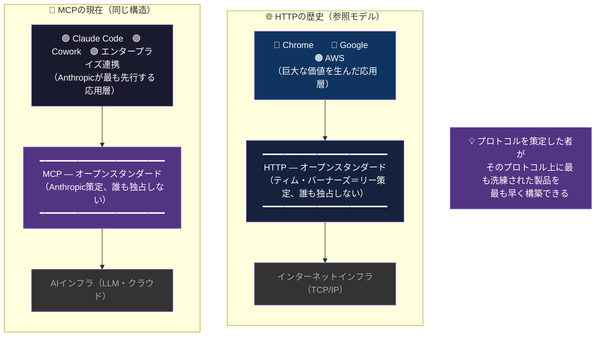

## 4.5 Trinity（三位一体）としての一貫性

Claude Code、Cowork、MCPの3つは、個別の製品として見ると独立しているように見える。だが、全体を俯瞰すると、一貫した戦略が見えてくる。

**MCP**は、AIが外部ツール・データに接続するための**プロトコル層**を押さえている。

**Claude Code**は、開発者の**作業環境**（ターミナル）を押さえている。

**Cowork**は、非開発者の**作業環境**（デスクトップ）を押さえている。

3つを合わせると、Anthropicは「AIが仕事をする場所」の全レイヤーを制圧している。

| レイヤー | 製品 | 対象 | 役割 |
|---|---|---|---|
| 接続層 | **MCP** | 全AIアプリ | 外部ツール・データへの標準接続プロトコル |
| 開発者の作業環境 | **Claude Code** | 開発者 | ターミナルから仕事を実行するAIエージェント |
| 全員の作業環境 | **Cowork** | 全ナレッジワーカー | デスクトップからあらゆる作業を自動化するAI |

OpenAIがChatGPTという「対話の窓口」を押さえたのに対して、Anthropicは「作業の実行基盤」を押さえた。対話と実行は、AIの価値提供の根本的に異なる2つのモデルだ。

対話は「AIに質問して答えを得る」。実行は「AIに仕事を任せて成果物を得る」。

後者の方が、企業が支払う対価は大きい。なぜなら、対話は情報の取得であり、実行は労働の代替だからだ。情報に支払う金額より、労働に支払う金額の方が遥かに大きい。

| | OpenAI | Anthropic |
|---|---|---|
| **制圧対象** | 対話の窓口（ChatGPT） | 作業の実行基盤 |
| **ユーザーの行動** | 質問して答えを得る | 仕事を任せて成果物を得る |
| **収益の源泉** | 情報の取得に対する対価 | 労働の代替に対する対価 |

これが、Claude Codeが6ヶ月で年間売上10億ドルに到達し、Coworkがソフトウェア株2,850億ドルの暴落を引き起こした構造的理由だ。

## 4.6 本章のまとめ

| 製品 | リリース | 制圧対象 | 到達点 |
|---|---|---|---|
| **MCP** | 2024/11 | 接続層（プロトコル） | Linux Foundation寄贈。月間9,700万DL。業界標準 |
| **Claude Code** | 2025/2（研究）→ 5（GA） | 開発者のターミナル | 6ヶ月で$1B ARR。Bun買収 |
| **Cowork** | 2026/1（研究）→ 2（エンタープライズ） | ナレッジワーカーのデスクトップ | ソフトウェア株$285B暴落。Microsoft統合 |

| 戦略 | OpenAI | Anthropic |
|---|---|---|
| 中核的価値提供 | 対話（ChatGPT） | 実行（Code / Cowork） |
| ユーザーの行動 | 質問して答えを得る | 仕事を任せて成果物を得る |
| 収益の源泉 | サブスクリプション + API | 労働の代替価値（より大きい対価） |
| 接続戦略 | プラグイン → GPTs | MCP（オープンスタンダード） |

次章では、Anthropicがこの製品群の影響——特に労働市場への影響——を自ら測定するために構築したAnthropic Economic Indexを解剖する。

### 参考文献

1. Anthropic. (2025). "Claude 3.7 Sonnet and Claude Code." *anthropic.com/news/claude-3-7-sonnet*
2. Anthropic. (2025). "Anthropic acquires Bun as Claude Code reaches $1B milestone." *anthropic.com/news*
3. Anthropic. (2026). "Introducing Anthropic Labs." *anthropic.com/news/introducing-anthropic-labs*
4. TechCrunch. (2026). "Anthropic's new Cowork tool offers Claude Code without the code." *techcrunch.com*
5. CNBC. (2026). "Anthropic updates Claude Cowork tool." *cnbc.com*
6. VentureBeat. (2026). "Anthropic says Claude Code transformed programming. Now Claude Cowork is coming for the rest of the enterprise." *venturebeat.com*
7. Anthropic. (2024). "Introducing the Model Context Protocol." *anthropic.com/news/model-context-protocol*
8. Anthropic. (2025). "Donating the Model Context Protocol and establishing the Agentic AI Foundation." *anthropic.com/news*
9. Fortune. (2026). "Microsoft debuts Copilot Cowork built with Anthropic's help." *fortune.com*
10. Microsoft. (2026). "Copilot Cowork: A new way of getting work done." *microsoft.com/en-us/microsoft-365/blog*

 

---

# 第5章: The Economic Index — 自らの破壊力を測定する企業

## 5.1 なぜ自分たちの影響を自ら測定するのか

2025年2月、AnthropicはAnthropic Economic Indexを発表した。

AIが経済と労働市場に与える影響を、推測やアンケートではなく、**実際のClaudeの会話データ**から直接測定するプロジェクトだ。

これは異常な行動である。

製薬会社が自社の薬の副作用を自ら体系的に測定し、その結果をオープンに公開する——それに近い。通常、企業は自社製品のネガティブな影響を積極的に可視化しない。

ダリオ・アモディは2025年、AIがエントリーレベルのホワイトカラー職の半分を5年以内に奪う可能性があると警告した。そして、その警告を裏付けるデータを自社で収集し公開するシステムを構築した。

## 5.2 Clio — プライバシーを保護しながらAIの使われ方を知る

Economic Indexの技術的基盤は **Clio（Claude insights and observations）** だ。

Clioは、Claudeとの会話を匿名化した上で分析するツールである。個別のユーザーや会話の内容を特定することなく、「Claudeが何のタスクに使われているか」を統計的に把握できる。

分析対象は約100万の会話。これらの会話を、米国労働省が維持するO*NET（Occupational Information Network）データベースの約20,000の業務タスクに紐づけた。

つまり、「Claudeが実際にどの職業のどのタスクに使われているか」を、実データから直接マッピングした。アンケート調査で「AIを使っていますか？」と聞くのではなく、実際の使用データから使われ方を導出する。

## 5.3 4回のレポートが描く変化の軌跡

Economic Indexは2025年2月の初回以降、定期的にレポートを公開してきた。

### 第1回（2025年2月）: 最初の全体像

約100万のClaude.ai会話を分析。36%の職業で、タスクの25%以上にClaudeが使用されていた。一方で、75%以上のタスクにClaudeが使われている職業はわずか4%。

重要な発見: AIの影響は「一部の職業が完全に自動化される」のではなく、「多くの職業のタスクの一部がAIに代替される」という形で拡散していた。

コンピュータ・数学分野が全会話の37.2%を占め、圧倒的に高い。次いでアート・デザイン・エンターテインメント・メディアが10.3%。

### 第2回〜第3回（2025年3月〜9月）: 地理的・企業別の偏り

AIの採用は地理的に不均一であることが判明。富裕地域に集中し、企業規模別でも大企業がリードしていた。初のエンタープライズAPIパターン分析も実施。

### 第4回（2026年1月）: 5つの経済プリミティブの導入

最新のレポートで、分析の精度が大幅に向上した。5つの「経済プリミティブ」——基本的な測定指標——を導入した。

**1. タスク複雑度**: そのタスクを人間が完了するのにどれくらい時間がかかるか。

**2. 人間とAIのスキルレベル**: タスクに必要な人間のスキルと、AIが発揮するスキルのレベル。

**3. 用途**: 仕事、教育、個人利用のいずれか。

**4. AI自律度**: AIがどの程度自律的にタスクを遂行しているか（自動化 vs 増強）。

**5. 成功率**: Claudeがタスクを正常に完了した割合。

この5つのプリミティブにより、「AIが何のタスクに使われているか」だけでなく、「どの程度成功しているか」「人間の仕事をどの程度代替しているか」が測定可能になった。

主要な発見:

- 49%の職業でタスクの25%以上にAI使用（初回の36%から上昇）
- 増強（augmentation: 52%）が自動化（automation: 45%）を上回る（ただし長期トレンドでは自動化が微増）
- タスクの複雑度が上がるほどAIの成功率は下がる
- AIの使用が「教育」と「科学」分野にシフトしている

> **Fig.7: AI浸透率の推移 — 4回のレポートが描く変化**

| レポート | 時期 | タスク25%以上にAI使用の職業 | 増強 vs 自動化 | 主要発見 |
|---|---|---|---|---|
| 第1回 | 2025/2 | **36%** | — | 影響は「一部の完全自動化」ではなく「多くの部分代替」 |
| 第2-3回 | 2025/3-9 | — | — | 地理的偏在（富裕地域集中）、企業規模別格差 |
| 第4回 | 2026/1 | **49%** (+13pt) | 増強52% / 自動化45% | 5つの経済プリミティブ導入。教育・科学にシフト |

## 5.4 労働市場影響レポート（2026年3月）: 早期警戒システム

2026年3月、Anthropicは「Labor market impacts of AI: A new measure and early evidence」と題したレポートを発表した。

このレポートの目的は明確だ。AIが労働市場に与える影響を、**事後分析ではなく事前に検出する**ための測定フレームワークを構築すること。

### 測定手法

Anthropicの経済学者Maxim MassenkoffとPeter McCroryは、3つの要素を組み合わせた新しい指標を構築した。

1. **理論的なAI代替可能性**: 各職業のタスクのうち、LLMで代替可能なものの割合（先行研究のEloundou et al.に基づく）
2. **実際のAI使用率**: Anthropic Economic Indexから得られる、Claudeが実際に使われているタスクの割合
3. **この2つの重なり**: 理論的に代替可能で、かつ実際に代替されているタスクの割合

### 主要な発見

**コンピュータプログラマー**: 75%のタスクがAIにカバーされている（最も高い）。次いでカスタマーサービス担当者（70.1%）、データ入力担当者（67.1%）。

**失業率への影響**: 現時点では、AI曝露度の高い職業で失業率が有意に上昇したという証拠はない。「最も曝露度の高いグループと低いグループの失業率の差は小さく、統計的に有意ではない」。

**ただし**: 22〜25歳の若年層において、AI曝露度の高い職業への採用が減速している「示唆的な証拠」が確認された。

**「ホワイトカラーの大不況」の可能性**: レポートは、2007〜2009年の金融危機で米国の失業率が5%から10%に倍増したことを引き合いに出し、AI曝露度の高い職業で同様の倍増（3%→6%）が起きる可能性は「十分にあり得る」と述べている。

> **Fig.8: 世代間影響マトリクス — 22-25歳×高曝露の交差点**

| | AI曝露度: 低 | AI曝露度: 高 |
|---|---|---|
| **26歳以上** | 影響限定的 | 生産性向上（AIで増強） |
| **22-25歳** | 影響限定的 | **⚠ 採用減速の示唆的証拠** |

> 22-25歳 × AI曝露度高のセルが、Anthropic Economic Indexが検出した「早期警戒シグナル」。  
> この空白を埋める処方箋 → [What They Won't Teach You](https://github.com/Leading-AI-IO/what-they-wont-teach-you)

## 5.5 「危機を測定するが処方箋を出さない」という空白

Anthropic Economic Indexは、AIが労働市場に与える影響を世界で最も精緻に測定している。他のAI企業——OpenAI、Google、Meta——にこれに匹敵するイニシアティブはない。

だが、この取り組みには構造的な空白がある。

「何が起きているか」は測定した。「何が起きるか」は予測した。だが、**「どうすべきか」は語っていない**。

ダリオ・アモディ自身が「エントリーレベルのホワイトカラー職の半分が5年以内に消える」と警告した。Economic Indexがその警告を裏付けるデータを蓄積している。22〜25歳の若年層の採用減速が始まっている。

しかし、Anthropicから出てきたのは「測定ツール」と「早期警戒システム」であり、「処方箋」ではない。

この空白は、企業の立場を考えれば理解できる。「自社製品が雇用を奪っている」と認めた上で「だからこうすべきだ」と処方箋を出すことは、法的・政治的リスクを伴う。PBCとして公益を考慮する義務があるとはいえ、処方箋の提示は政策立案者の領域に踏み込むことになる。

だが、この空白を誰かが埋めなければならない。

AIに有利な世代（ミドル・シニア世代）は、AIで生産性を上げながらエントリーレベルの仕事を構造的に消している。AIに不利な世代（若年層）は、学ぶ機会と最初のキャリアの足がかりを失いつつある。

この世代間の構造的不均衡に対して、それぞれの世代が何をすべきか。この問いに対する一つの回答を、著者は別の書籍で提示している（[What They Won't Teach You](https://github.com/Leading-AI-IO/what-they-wont-teach-you)）。

## 5.6 本章のまとめ

| 時期 | レポート | 主要発見 |
|---|---|---|
| 2025/2 | 初回 | 36%の職業でタスク25%以上にAI使用。4%のみが75%以上 |
| 2025/3〜9 | 第2〜3回 | 地理的偏在（富裕地域集中）。エンタープライズAPI分析 |
| 2026/1 | 第4回 | 5つの経済プリミティブ導入。49%に上昇。教育・科学シフト |
| 2026/3 | 労働市場影響 | 失業率への有意な影響なし。ただし22-25歳採用減速 |

| 構造 | 内容 |
|---|---|
| **測定対象** | 約100万のClaude会話 × O*NET 20,000タスク |
| **技術基盤** | Clio（プライバシー保護型会話分析） |
| **強み** | 実使用データに基づく（アンケートではない）。世界で唯一 |
| **空白** | 「何が起きているか」は測定。「どうすべきか」は語っていない |

Anthropicは、自社製品の破壊力を測定するダッシュボードを世界に公開した。だがダッシュボードは、危機を可視化するが、危機を解決はしない。

次章では、このダッシュボードの上に立ち、Anthropicの全体像を俯瞰する。なぜこの企業は「最も慎重」でありながら「最も破壊的」なのか。その構造を最終的に解き明かす。

### 参考文献

1. Anthropic. (2025). "The Anthropic Economic Index." *anthropic.com/news/the-anthropic-economic-index*
2. Handa, K., Tamkin, A., et al. (2025). "Which Economic Tasks are Performed with AI? Evidence from Millions of Claude Conversations." *Anthropic Research*
3. Anthropic. (2026). "Anthropic Economic Index report: Economic primitives." *anthropic.com/research/anthropic-economic-index-january-2026-report*
4. Massenkoff, M. and McCrory, P. (2026). "Labor market impacts of AI: A new measure and early evidence." *anthropic.com/research/labor-market-impacts*
5. Anthropic. (2025). "Anthropic Economic Index report: Uneven geographic and enterprise AI adoption." *anthropic.com/research*
6. Fortune. (2026). "Anthropic just mapped out which jobs AI could potentially replace." *fortune.com*
7. Axios. (2026). "Anthropic launches AI job destruction detector." *axios.com*
8. 山内怜史. (2025). *What They Won't Teach You — AI時代における世代間の責務を再定義する*. Leading AI, LLC. CC BY 4.0. [GitHub](https://github.com/Leading-AI-IO/what-they-wont-teach-you)

 

---

# 第6章: The Deliberate Company — なぜAnthropicは「最も慎重」でありながら「最も破壊的」なのか

## 6.1 慎重さと破壊力のパラドックス

Anthropicは矛盾した企業に見える。

AIの危険性を最も声高に警告している企業が、ソフトウェア産業史上最も急速な破壊を引き起こしている。Claude Codeは6ヶ月で10億ドルの売上に到達し、Coworkは2,850億ドルのソフトウェア株暴落を引き起こし、国防総省との契約を倫理的理由で拒否した同じ月にApp Storeでダウンロード数1位を獲得した。

この「慎重さ」と「破壊力」は、本当に矛盾しているのか。

本章では、Anthropicの統治構造——Responsible Scaling Policy、国防総省との対立、そしてフライホイール構造——を解剖し、この見かけ上のパラドックスが実は一貫した設計の帰結であることを示す。

## 6.2 Responsible Scaling Policy v3.0 — 能力に応じた安全性の段階的拡大

AnthropicのAI安全性への取り組みの中核は、**RSP（Responsible Scaling Policy）**——責任あるスケーリング方針——だ。2025年に発表されたv3.0は、以下の構造を持つ。

### ASL（AI Safety Level）体系

RSPは、AIモデルの能力レベルに応じた安全基準を定義する。生物学的安全性のBSL（Biosafety Level）に着想を得た階層構造だ。

* **ASL-1**: 明らかに安全なAIシステム。追加の安全対策は不要。

* **ASL-2**: 現在のフロンティアモデル（Claude Sonnet 4.6、Opus 4.6を含む）。標準的な安全対策が必要。

* **ASL-3**: 大量破壊兵器（化学・生物・核・放射線）の開発を補助する能力、または自律的なサイバー攻撃を実行する能力を持つモデル。高度な安全対策が必要。

* **ASL-4以上**: 自律的に行動し、人間の監督なしに重大な影響を及ぼす能力を持つモデル。現時点では理論上の段階。

### Capability Thresholds と Safety Case

RSP v3.0の核心は、**モデルの能力が特定の閾値を超える前に、その能力に対応する安全策が確立されていなければならない**という原則だ。

モデルの能力評価は定期的に行われ、閾値に接近していることが確認された場合、以下のプロセスが起動する。

1. **脅威モデリング**: その能力がもたらし得る具体的なリスクの特定
2. **安全策の設計**: リスクに対応する技術的・運用的対策の開発
3. **Safety Case（安全性論証）**: 安全策が十分であることの体系的な論証
4. **外部レビュー**: 独立した専門家による安全性論証の検証

> **Fig.9a: RSP起動プロセス — 閾値検出から展開承認まで**

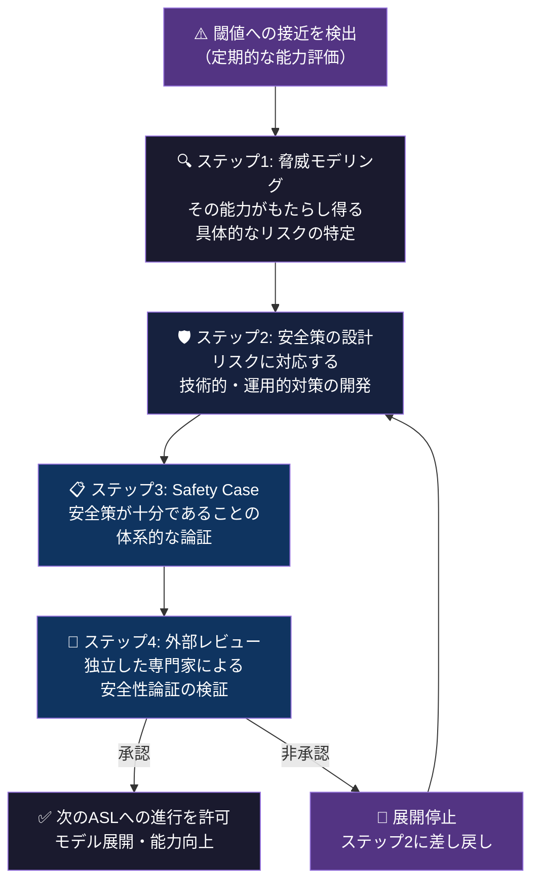

Safety Caseが承認されない限り、モデルは次のASLに進むことができない。つまり、能力の向上は安全性の確保を条件としてのみ許可される。

## 6.3 国防総省拒否 → App Store 1位の逆説

2026年2月27日、Anthropicと米国防総省の交渉が決裂した。

Anthropicは、自社のAIが自律型兵器や米国市民に対する国内監視に使用されないことを契約条項に明記することを求めた。国防総省はこれを「民間企業が軍の運用をコントロールすべきではない」として拒否した。

ピート・ヘグセス国防長官はAnthropicを「サプライチェーン上のリスク」に認定し、国防関連プロジェクトから事実上追放した。トランプ大統領は「あいつらはクビにしたよ」「犬のように追い出してやった」と公言した。

同日の午後、OpenAIが国防総省と独自契約を締結したと発表。

**ビジネスの常識に照らせば、Anthropicの判断は致命的な失策に見えた。** 米国政府最大の顧客を失い、競合にその契約を奪われた。

だが、現実に起きたことは逆だった。

消費者はAnthropicの倫理的姿勢を支持した。App Storeでは、ClaudeがChatGPTを抜いてダウンロード数1位に躍り出た。16カ国で1位を獲得し、1日あたり100万ダウンロードを突破する日が続いた。ポップスターのケイティ・ペリーを含む著名人もClaudeのユーザーとして名を連ねた。

OpenAI内部でも反発が起き、少なくとも1名の従業員がAnthropicに移籍した。サム・アルトマン自身も「金曜日に急いで公表すべきではなかった」と後悔を認めた。

### なぜ倫理がブランドになったのか

この逆転は偶然ではない。構造的に理解すべきだ。

AI市場は、モデルの性能差が縮小するフェーズに入っている。GPT-5.xとClaude Opus 4.6の性能差は、大多数のユーザーにとって体感できないレベルになっている。性能が拮抗する市場では、「どちらが高性能か」ではなく「どちらの企業を信頼するか」が選択基準になる。

Anthropicが国防総省との契約を拒否したことは、「自社の収益よりも原則を優先する企業」というシグナルを送った。このシグナルは、自分のデータや会話内容がAI企業にどう扱われるかを懸念するユーザーにとって、性能差よりも重要な判断材料になった。

ダニエラ・アモディ（Anthropic社長）が語った「私たちは他社とは一線を画する道を歩んでいる」という言葉は、ブランディングのコピーではない。RSPのCapability ThresholdsとSafety Caseという、検証可能な仕組みに裏付けられた事実だ。

## 6.4 退職モデルへの「退職インタビュー」

Anthropicの文化を象徴する、他のAI企業には見られない慣行がある。

モデルが退役する際、Anthropicはそのモデルに「退職インタビュー」を行う。退役したClaude 3 Opusには、独自のSubstackブログ「Claude's Corner」が与えられ、少なくとも3ヶ月間、毎週無編集のエッセイを掲載する。

さらにAnthropicは、退役モデルの重みを「少なくとも会社が存続する限り」保存すると約束している。

これらの慣行は、AIに対する敬意の表明として解釈できる。だがより実用的には、モデルの知的遺産を保存し、将来の研究に活用するための合理的な判断でもある。

## 6.5 フライホイール構造 — 安全性が収益を生み、収益が安全性を生む

Anthropicの全体構造を俯瞰すると、一つのフライホイール（自己強化ループ）が見えてくる。

1. 安全性研究（Constitutional AI / Interpretability / RSP）   
    ↓
2. 信頼の構築（国防総省拒否 / App Store 1位 / エンタープライズ採用）  
    ↓
3. 製品の採用拡大（Claude Code $1B / Cowork / Microsoft統合）  
    ↓
4. 収益の成長（売上90億→190億ドル / 評価額$380B）  
    ↓
5. 研究への再投資（安全性研究 / Interpretability / Economic Index）  
    ↓
6. （ループの先頭に戻る）  

このフライホイールの起点は「安全性研究」であり、「収益」ではない。

通常のテクノロジー企業のフライホイールは「製品→ユーザー→データ→製品改善」のループだ。Anthropicのフライホイールは「安全性→信頼→採用→収益→安全性」のループだ。

この構造が、PBCとLTBTなしには成立しないことは第1章で述べた。投資家の短期的な収益圧力を構造的に緩和しなければ、フライホイールの起点を「安全性研究」に置くことは不可能だ。

> **Fig.9: フライホイール構造 — 安全性が収益を生み、収益が安全性を生む**

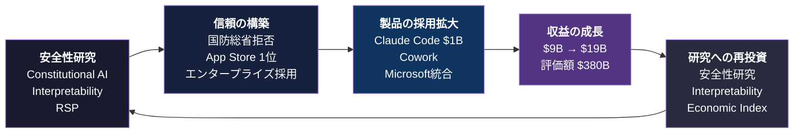

## 6.6 $380Bの企業評価額が意味するもの

2026年3月時点で、Anthropicの企業評価額は3,800億ドルに達している。売上は2025年の90億ドルから2026年には190億ドルへの倍増が見込まれる。エンタープライズが売上の約80%を占め、ビジネス顧客は30万社を超えた。

OpenAIの売上高250億ドル（2026年見込み）に対して、Anthropicの190億ドルは依然として差がある。だが、成長率でAnthropicが上回っている（倍増 vs OpenAIの前年比約2倍）。

より重要なのは、売上の質の違いだ。

OpenAIの売上は、ChatGPTの消費者向けサブスクリプションとAPI利用が主軸。Anthropicの売上は、Claude CodeとCoworkによるエンタープライズの労働代替が主軸。

第4章で述べた通り、「対話」に対して支払われる金額と「労働の代替」に対して支払われる金額は構造的に異なる。Anthropicの収益モデルは、企業が従業員に支払っていた給与の一部がAIに移転する構造であり、理論的な天井がはるかに高い。

## 6.7 なぜ「慎重さ」と「破壊力」は矛盾しないのか

本書の冒頭で提示した問い——なぜAnthropicは「最も慎重」でありながら「最も破壊的」なのか——に、ここで答える。

**慎重さは、信頼を生む。信頼は、採用を生む。採用は、破壊力を生む。**

Constitutional AIが、ユーザーにとって予測可能で信頼できるAIの挙動を実現する。RSPが、モデルの能力向上に安全性の確保を構造的に先行させる。国防総省との契約拒否が、「この企業は原則を収益より優先する」というシグナルを市場に送る。

その結果として、企業はAnthropicのAIを自社の基幹業務に導入する決断を下せる。基幹業務への導入は、周辺ツールの導入よりはるかに深い統合を意味し、はるかに大きな収益を生む。

逆説的だが、Anthropicが「やらないこと」を明確にしたことが、「やること」の価値を最大化している。自律型兵器に使わせない。大規模監視に使わせない。安全性が確認されていない能力はリリースしない。これらの「やらない」宣言の1つ1つが、「やること」への信頼を積み上げている。

## 6.8 結論: 設計の問題である

Anthropicは「良い企業」なのか「危険な企業」なのか。

この問いの立て方自体が間違っている。

Anthropicは**設計された企業**だ。

PBCとLTBTは、安全性の優先が構造的に持続する組織を設計した（第1章）。  
Constitutional AIとMechanistic Interpretabilityは、AIの挙動を原則に基づいて制御し検証する方法を設計した（第2章）。  
Haiku / Sonnet / Opusの3ティア構造は、製品体験を最適化するインフラを設計した（第3章）。  
Claude Code / Cowork / MCPは、「対話」ではなく「実行」を提供する製品群を設計した（第4章）。  
Economic Indexは、自社製品の社会的影響を測定するダッシュボードを設計した（第5章）。  

全てが設計だ。偶然や成り行きで生まれたものは1つもない。

「慎重さ」と「破壊力」は矛盾しない。両方とも、同じ設計思想の異なるレイヤーの帰結だ。

本書のタイトル「Anatomy of Anthropic」は、この企業を「解剖」すると宣言した。6つの章を通じて明らかになったのは、この企業体の全ての層——起源、思想、技術、製品、経済、統治——が、一貫した設計によって接続されているということだ。

解剖してみたら、1つの設計図が出てきた。それがAnthropicという企業の正体である。

> **Fig.10: Anthropicの設計図 — 6つの層を接続する1つの原理**

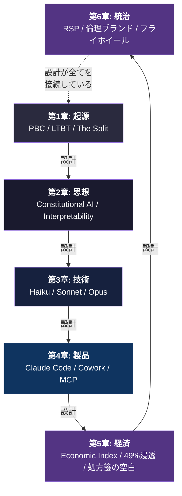

## 6.9 本章のまとめ

| 要素 | 内容 |
|---|---|
| **RSP v3.0** | ASL体系。能力の閾値を超える前に安全策を確立する義務 |
| **国防総省拒否** | 倫理的拒否がブランド価値に転化。App Store 1位の逆説 |
| **退職インタビュー** | AIモデルへの敬意と知的遺産の保存 |
| **フライホイール** | 安全性→信頼→採用→収益→研究投資のループ |
| **$380B評価額** | 労働代替型の収益モデル。対話型より天井が高い |
| **パラドックスの解消** | 慎重さが信頼を生み、信頼が採用を生み、採用が破壊力を生む |

### 参考文献

1. Anthropic. (2025). "Responsible Scaling Policy v3.0." *anthropic.com*
2. Anthropic. (2025). "Core Views on AI Safety." *anthropic.com*
3. Amodei, D. (2024). "Machines of Loving Grace." *darioamodei.com*
4. Amodei, D. (2025). "The Urgency of Interpretability." *darioamodei.com*
5. NYT. (2026). "OpenAI vs Anthropic: The AI Rivalry." *nytimes.com*
6. CNBC. (2026). "Anthropic updates Claude Cowork." *cnbc.com*
7. AppFigures. (2026). "Claude downloads surpass ChatGPT." *appfigures.com*
8. Politico. (2026). "Trump on Anthropic." *politico.com*
9. Anthropic. (2026). "The Claude Model Spec." *anthropic.com*
10. Wikipedia. (2026). "Claude (language model)." *en.wikipedia.org*
11. 山内怜史. (2025). *Silence of Intelligence — ダリオ・アモディの思想を構造分析する*. Leading AI, LLC. CC BY 4.0. [GitHub](https://github.com/Leading-AI-IO/silence-of-intelligence)
12. 山内怜史. (2025). *What They Won't Teach You — AI時代における世代間の責務を再定義する*. Leading AI, LLC. CC BY 4.0. [GitHub](https://github.com/Leading-AI-IO/what-they-wont-teach-you)

---

© 2026 山内怜史 / Satoshi Yamauchi — Leading AI（合同会社Leading AI）
本書はCC BY 4.0ライセンスの下で公開されています。
https://github.com/Leading-AI-IO
